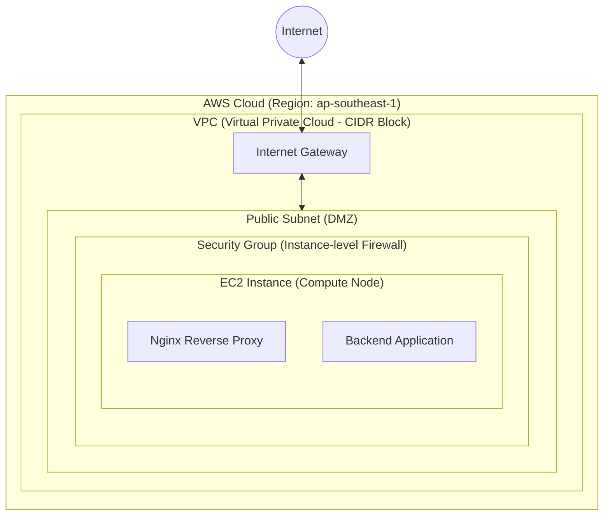

# AWS Architecture Concepts & Mental Model

> [!NOTE]
> Tài liệu này mô tả cấu trúc vật lý và logic của các dịch vụ AWS cốt lõi, cung cấp góc nhìn tổng quan về kiến trúc hệ thống trước khi tiến hành triển khai bằng Terraform. 
> Việc hiểu rõ nền tảng ảo hóa là tiền đề bắt buộc để nắm bắt tư duy thiết kế mạng (Networking) trên môi trường Cloud.

## 1. Nền tảng Ảo hóa (Virtualization Fundamentals)

Để làm chủ kiến trúc mạng, kỹ sư cần hiểu rõ bản chất vật lý của hệ thống Cloud Compute.

### 1.1. Bản chất của Máy chủ Ảo (Compute Virtualization)
- **Hạ tầng Vật lý (Bare Metal):** Tại các trung tâm dữ liệu, Cloud Provider vận hành các máy chủ vật lý (Hosts) với tài nguyên phần cứng khổng lồ.
- **Nghịch lý Dùng chung (Multi-tenancy) & Cách ly (Isolation):** Về bản chất kinh tế, một máy chủ vật lý lớn bắt buộc phải được chia sẻ cho nhiều khách hàng khác nhau cùng sử dụng (Multi-tenancy) để tối ưu chi phí. Câu hỏi đặt ra là: Làm sao để khách hàng A không thể đọc trộm RAM hay chiếm đoạt CPU của khách hàng B?
- **Lớp Ảo hóa (Hypervisor - Trọng tài cấp phần cứng):** 
  - Để giải quyết bài toán trên, AWS chèn vào giữa phần cứng và hệ điều hành một lớp quản lý gọi là Hypervisor (trên AWS là kiến trúc Nitro System).
  - **Cách ly CPU (Time-Slicing):** Hypervisor băm nhỏ thời gian xử lý của CPU vật lý theo đơn vị micro-giây. Máy ảo A chạy xong vi lệnh sẽ bị đóng băng trạng thái để nhường CPU cho máy ảo B. Tốc độ hoán đổi (Context Switching) nhanh đến mức Hệ điều hành bên trong máy ảo A bị "đánh lừa" và tin rằng nó đang sở hữu CPU liên tục.
  - **Cách ly Bộ nhớ (Memory Isolation thông qua MMU):** Hypervisor ánh xạ (Mapping) bộ nhớ ảo của máy ảo A vào vùng RAM vật lý từ byte 0 đến byte X, và máy ảo B từ byte Y đến Z. Khi CPU thực thi lệnh, chip quản lý bộ nhớ (MMU - Memory Management Unit) trên bo mạch chủ sẽ kiểm tra chéo. Nếu máy ảo A cố tình truy cập ra ngoài vùng được cấp phát, MMU sẽ kích hoạt ngắt phần cứng (Hardware Exception) và Hypervisor lập tức chặn đứng tiến trình này.
- **Kết quả (Compute Isolation):** Dù chia sẻ chung một bo mạch chủ, chung một thanh RAM và CPU vật lý, nhưng dưới sự áp đặt kỷ luật thép của Hypervisor ở tầng vi mạch, mỗi EC2 Instance hoàn toàn bị giam lỏng trong một "hộp cát" (Sandbox). Chúng "mù" và "điếc" hoàn toàn trước sự tồn tại của các láng giềng.

### 1.2. Sự Hình thành Mạng Ảo (Sự ra đời của VPC)
- **Bài toán Cốt lõi:** Khi hàng triệu EC2 Instance độc lập được sinh ra trên các Host vật lý khác nhau, chúng cần cơ chế giao tiếp an toàn (Networking) mà không bị lộ lọt dữ liệu (Data Leakage) giữa các khách hàng (Tenants). 
- **Sự Bất khả thi của Mạng Truyền thống:** Việc quy hoạch mạng bằng công nghệ VLAN truyền thống là bất khả thi ở quy mô đám mây (Cloud Scale) vì 3 giới hạn rào cản sau:
  1. **Giới hạn số lượng mạng (The 4K VLAN Problem):** Giao thức mạng chia lô logic truyền thống (IEEE 802.1Q VLAN) chỉ sử dụng nhãn định danh (Tag) 12-bit, nghĩa là một hệ thống vật lý chỉ có thể hỗ trợ tối đa 4,096 mạng độc lập. Với quy mô hàng chục triệu khách hàng của AWS, con số 4096 là quá nhỏ bé.
  2. **Tràn bộ nhớ Switch (MAC Table Exhaustion):** Các Switch chuyển mạch vật lý sử dụng bộ nhớ tốc độ cao CAM (Content-Addressable Memory) để lưu danh bạ địa chỉ MAC của các thiết bị. Với tốc độ khởi tạo và hủy bỏ hàng chục triệu máy ảo mỗi giây trên toàn AWS, bộ nhớ CAM của Switch vật lý sẽ lập tức bị tràn (Overflow), dẫn đến việc Switch gửi gói tin lung tung (Broadcast Storm) và làm sập toàn bộ hệ thống.
  3. **Độ trễ Cấu hình (Configuration Latency):** Cơ sở hạ tầng đám mây yêu cầu tính năng tự động hóa (Automation). Không thể lập trình các kịch bản bắt Switch vật lý tự cấu hình lại cổng (Ports) mỗi khi một máy ảo sinh ra trong vòng vài mili-giây.
- **Giải pháp - Software-Defined Networking (SDN):** Để phá vỡ các giới hạn vật lý trên, AWS phát triển một lớp mạng ảo hóa hoàn toàn bằng phần mềm. Bằng cách sử dụng các giao thức đóng gói tiên tiến (sử dụng nhãn định danh 24-bit, hỗ trợ tới 16 triệu mạng độc lập), logic định tuyến được mang thẳng lên Hypervisor, bỏ qua hoàn toàn sự phụ thuộc vào các Switch vật lý truyền thống bên dưới.
- **Sự ra đời của VPC:** Khái niệm **VPC (Virtual Private Cloud)** ra đời từ kiến trúc SDN này. Nó đóng vai trò là một "vùng bao bọc logic" (Logical Enclosure) cho phép người dùng nhóm các EC2 Instance lại với nhau thành một mạng nội bộ biệt lập. Mạng ảo này hoạt động chồng đè (Overlay Network) lên trên mạng cáp quang vật lý (Underlay Network) mà các thiết bị vật lý bên dưới không hề hay biết.

---

## 2. Đặc tả Thành phần Mạng (Network Components)

Tiếp nối từ nguyên lý ảo hóa, luồng dữ liệu (Traffic) bên trong VPC được định hình qua các thành phần lõi sau.

### 2.1. VPC (Virtual Private Cloud)
- **Bản chất Công nghệ (Underlying Technology):**
  - Trái với suy nghĩ thông thường, VPC không phải là mạng vật lý. Nó là mạng định nghĩa bằng phần mềm (SDN) vận hành trên hạ tầng AWS Nitro System.
  - VPC sử dụng giao thức đóng gói (Encapsulation) để tạo ra mạng ảo (Overlay Network), cho phép hàng triệu khách hàng dùng chung một dải IP (như `10.0.0.0/16`) mà không gây xung đột (IP Collision).
- **Tính Cách ly Tuyệt đối (Logical Isolation):**
  - Mặc định, VPC là môi trường "Air-gapped". Không có bất kỳ luồng dữ liệu nào được phép Ingress/Egress trừ khi có thiết bị định tuyến (Routing Device) được chủ động gắn vào.
  - Mọi nỗ lực giám sát gói tin (Packet Sniffing / Promiscuous Mode) chéo giữa các VPC trên cùng Hypervisor đều bị ngăn chặn ở cấp độ phần cứng.
- **Ranh giới Không gian Mạng (CIDR & Region Boundary):**
  - Bị giới hạn ở cấp độ Vùng địa lý (Region), ví dụ: `ap-southeast-1`. Tuy nhiên, VPC có thể trải dài (Span) qua nhiều Vùng sẵn sàng (Availability Zones) để đảm bảo High Availability (HA).

### 2.2. Subnet (Mạng con)
- **Định nghĩa:** Là kỹ thuật phân đoạn (Segmentation) chia nhỏ dải IP (CIDR Block) của VPC thành các miền phát sóng (Broadcast Domains) logic.
- **Vai trò:** Cô lập tài nguyên dựa trên cấp độ bảo mật.
  - **Public Subnet:** Bảng định tuyến (Route Table) chứa Route trỏ tới Internet Gateway. Tài nguyên được phép sở hữu Public IPv4 và định tuyến trực tiếp ra Internet.
  - **Private Subnet:** Không có định tuyến trực tiếp ra Internet. Phục vụ triển khai các hệ thống backend nhạy cảm (như Relational Databases). Nó bị giới hạn trong phạm vi Vùng sẵn sàng (Availability Zone) duy nhất.

### 2.3. Internet Gateway (IGW)
- **Định nghĩa:** Gateway có tính sẵn sàng cao, hoạt động như nút chuyển mạch phân giải địa chỉ (Address Resolution/NAT) ở rìa VPC.
- **Vai trò:** Cung cấp kết nối 2 chiều (Bidirectional) cho các máy ảo nằm trong Public Subnet giao tiếp với mạng Internet toàn cầu.

### 2.4. EC2 (Elastic Compute Cloud)
- **Định nghĩa:** Máy chủ ảo cung cấp năng lực điện toán (Compute Node). Nằm ở tầng thấp nhất trong sơ đồ tư duy, nó chính là kết quả của quá trình ảo hóa đã mô tả ở Mục 1.1.
- **Vai trò:** Vận hành Runtime Environment (Hệ điều hành, Web Server, Application Services). Nó nhận kết nối mạng (Network Interfaces - ENI) từ Subnet mà nó được triển khai.

### 2.5. Security Group
- **Định nghĩa:** Tường lửa ảo (Stateful Virtual Firewall) hoạt động ở cấp độ Instance (Layer 3/4).
- **Vai trò:** Bao bọc sát các ENI của EC2 Instance. Khác với NACL (hoạt động ở mức Subnet), Security Group chỉ áp dụng cho Instance. Nó kiểm duyệt lưu lượng (Traffic Filtering) dựa trên ma trận IP, Port và Protocol.

---

## 3. Sơ đồ Kiến trúc Tổng thể (Architecture Diagram)

## 4. Hiện trạng Triển khai (Current Deployment Context)

Trong cấu trúc Terraform hiện hành (`main.tf`):
- Hệ thống đang định nghĩa cấp phát `aws_instance` (EC2) và `aws_security_group`.
- Các tài nguyên cơ sở hạ tầng mạng lõi (VPC, Subnet, IGW) hiện đang ngầm sử dụng **Default VPC** do nền tảng AWS tự động khởi tạo.

> [!WARNING]
> Việc sử dụng Default VPC được khuyến nghị chỉ giới hạn trong phạm vi thử nghiệm (Testing/Development). Đối với môi trường vận hành thực tế (Production), Best Practice tiêu chuẩn yêu cầu Kỹ sư DevOps phải chủ động khai báo và cấp phát Custom VPC thông qua IaC (Terraform) nhằm kiểm soát tuyệt đối các chính sách bảo mật hạ tầng mạng.
