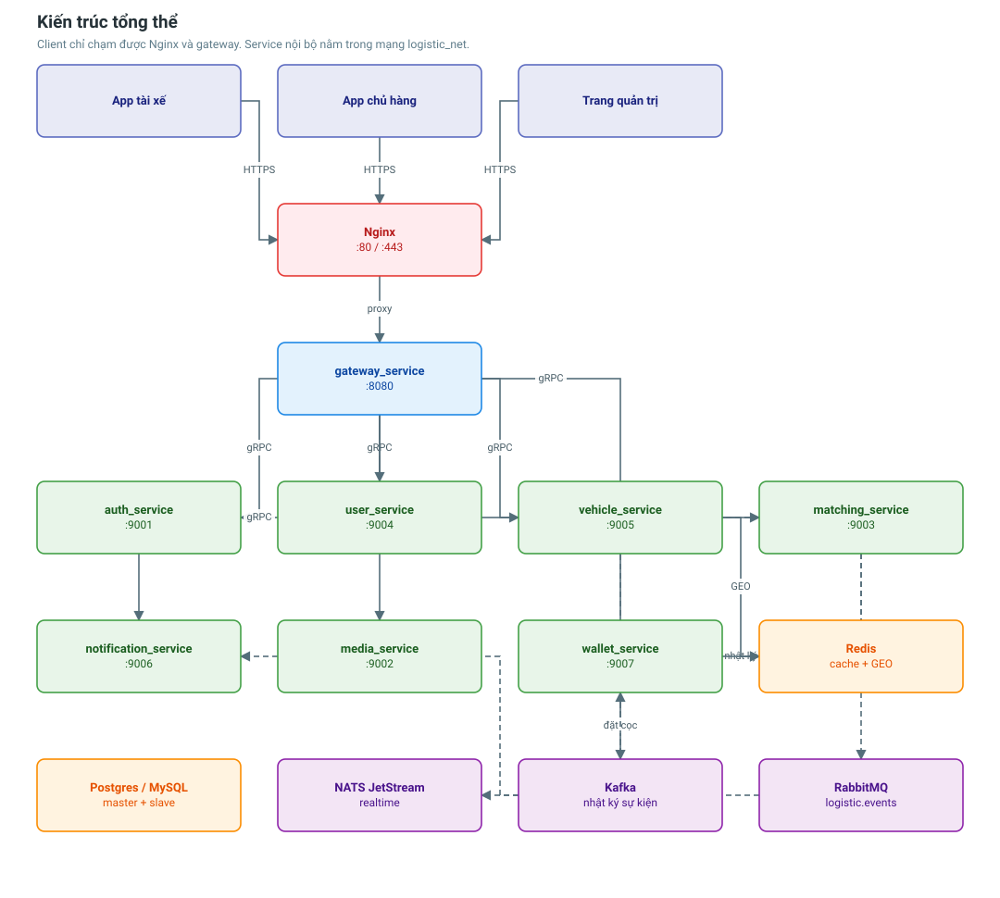
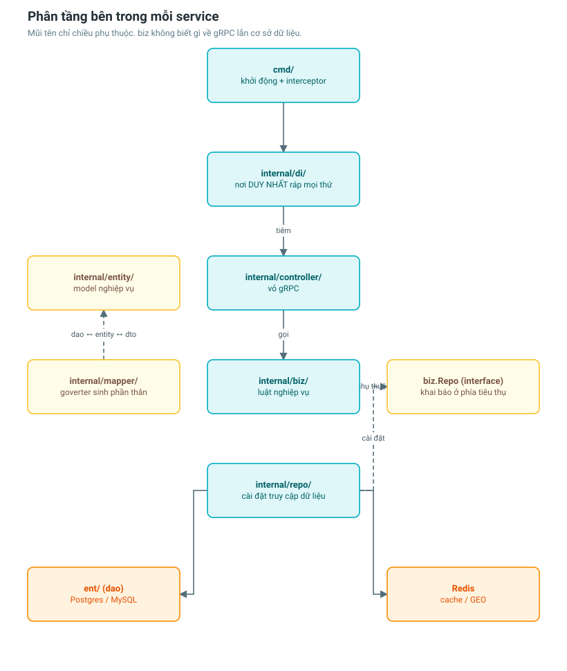

# Tổng quan hệ thống

Nền tảng ghép chuyến vận tải: chủ hàng đăng đơn, hệ thống tìm xe đang chạy phù
hợp, hai bên thương lượng giá và chốt hợp đồng.

---

## Sơ đồ tổng thể



Client bên ngoài **chỉ** chạm được Nginx → gateway. Các service nội bộ nằm trong
mạng `logistic_net` và chỉ nhận gRPC từ gateway hoặc từ nhau.

---

## Danh sách service

| Service | Cổng | Database | Vai trò |
|---|---|---|---|
| `gateway_service` | 8080 | — | Dịch HTTP ↔ gRPC, chuẩn hoá lỗi, chặn quyền admin |
| `auth_service` | 9001 | MySQL (master/slave) | Đăng nhập, JWT, Google OAuth2 |
| `media_service` | 9002 | — | Upload file (Cloudinary) |
| `matching_service` | 9003 | Postgres (master/slave) | Lõi ghép đơn ↔ xe |
| `user_service` | 9004 | Postgres (master/slave) | Danh tính, hồ sơ, sổ địa chỉ, thiết bị |
| `vehicle_service` | 9005 | Postgres (master/slave) | Phương tiện, giấy tờ, GPS, trạng thái nhận đơn |
| `notification_service` | 9006 | Postgres | Hộp thư thông báo, template, tuỳ chọn nhận tin |
| `wallet_service` | 9007 | MySQL + Elasticsearch | Ví, giao dịch, đặt cọc — **chưa có trong docker-compose** |

---

## Hạ tầng dùng chung

| Thành phần | Cổng | Dùng để làm gì |
|---|---|---|
| Redis | 6379 | Cache đọc + **chỉ mục GEO** xe đang online |
| RabbitMQ | 5672 / 15672 | Thông báo bền: matching → notification |
| Kafka (3 broker + 3 controller) | 19092 nội bộ | Nhật ký sự kiện lâu dài, ví/đặt cọc |
| NATS JetStream | 4222 | Đẩy realtime tới app đang mở |
| Elasticsearch + Kibana | 9200 / 5601 | Tra cứu giao dịch ví |

Ba broker phục vụ ba nhu cầu khác nhau — xem giải thích trong
[luồng matching → notification](../flows/matching-notification-flow.md).

Redis chia không gian khoá theo service:

| Service | DB index | Prefix |
|---|---|---|
| `user_service` | 0 | `user` |
| `vehicle_service` | 1 | `vehicle` |
| `notification_service` | 2 | `notif` |

---

## Phân tầng bên trong mỗi service



Mọi service Go đều theo cùng một khuôn:

```
cmd/                  điểm khởi động, gắn interceptor
 └── internal/
     ├── conf/        đọc biến môi trường
     ├── di/          nơi DUY NHẤT ráp mọi thứ lại
     ├── controller/  vỏ gRPC — không có luật nghiệp vụ
     ├── biz/         luật nghiệp vụ — không biết DB, không biết gRPC
     ├── repo/        tầng duy nhất chạm Postgres/Redis
     ├── entity/      model nghiệp vụ viết tay
     ├── mapper/      hợp đồng chuyển đổi (goverter sinh phần thân)
     └── common/errors/  bảng mã lỗi của service
```

Ba tầng dữ liệu và cách chuyển đổi:

```
ent.*     (dao — ent sinh)        biết cột, enum, con trỏ nullable
   ↕  goverter
entity.*  (viết tay)              ngôn ngữ nghiệp vụ thuần Go
   ↕  goverter
pb.*      (dto — protobuf sinh)   biết dây truyền, timestamppb
```

---

## Cơ sở dữ liệu — 22 bảng

| Service | Bảng |
|---|---|
| `user_service` | `users`, `driver_profiles`, `shipper_profiles`, `addresses`, `user_devices` |
| `vehicle_service` | `vehicles`, `vehicle_documents`, `vehicle_locations`, `driver_availabilities` |
| `notification_service` | `notifications`, `notification_templates`, `notification_preferences`, `processed_events` |
| `matching_service` | `asks`, `bids`, `matches`, `requirements`, `bids_requirements` |
| `auth_service` | `users` |
| `wallet_service` | `wallets`, `transactions`, `processed_messages` |

---

## API

67 endpoint qua gateway, chia hai nhánh:

- `/api/v1/...` — app tài xế và app chủ hàng (49 endpoint)
- `/api/v1/admin/...` — trang quản trị (18 endpoint)

Nhánh admin gắn `RequireRole("admin")` ở **cấp group**, nên thêm endpoint quản
trị mới là tự động được bảo vệ.

Tài liệu API đầy đủ: chạy hệ thống rồi mở `http://localhost:8080/swagger/index.html`.

---

## Xử lý lỗi xuyên tầng

```
ent.NotFoundError
      │  repo/repo_error.go — wrapError
      ▼
apperr.Error{Kind: NotFound, Code: "USER_NOT_FOUND"}
      │  pkg/middleware — ErrorInterceptor (gRPC)
      ▼
gRPC status NOT_FOUND + errdetails.ErrorInfo{Reason: "USER_NOT_FOUND"}
      │  gateway/internal/response — Error()
      ▼
HTTP 404 { "error": { "code": "USER_NOT_FOUND", "message": "..." } }
```

Client switch theo `code` (ổn định theo thời gian), không theo câu chữ. Chi tiết
kỹ thuật như tên bảng hay câu SQL chỉ nằm trong log, không lộ ra ngoài.

---

## Đọc tiếp

Tài liệu chia làm hai loại. **Service** mô tả bên trong một tiến trình;
**Flow** mô tả một nghiệp vụ chảy qua nhiều tiến trình.

### Chi tiết từng service — [docs/services/](../services/)

| Service | Tài liệu |
|---|---|
| `gateway_service` | [gateway-service.md](../services/gateway-service.md) |
| `auth_service` | [auth-service.md](../services/auth-service.md) |
| `user_service` | [user-service.md](../services/user-service.md) |
| `vehicle_service` | [vehicle-service.md](../services/vehicle-service.md) |
| `matching_service` | [matching-service.md](../services/matching-service.md) |
| `notification_service` | [notification-service.md](../services/notification-service.md) |
| `media_service` | [media-service.md](../services/media-service.md) |
| `wallet_service` | [wallet-service.md](../services/wallet-service.md) |

### Nghiệp vụ qua nhiều service — [docs/flows/](../flows/)

- [Tài xế gia nhập hệ thống](../flows/driver-onboarding-flow.md)
- [Chủ hàng đặt đơn tới khi chốt xe](../flows/shipper-order-flow.md)
- [GPS và tìm xe đang chạy](../flows/driver-location-flow.md)
- [Ghép xe và thông báo](../flows/matching-notification-flow.md)
- [Xác thực và phân quyền](../flows/authentication-flow.md)
- [Lỗi xuyên tầng](../flows/error-handling-flow.md)

### Khác

- [Đăng nhập Google OAuth2](oauth-google-flow.md)
- [Replication master-slave](database-replication.md)
- [Observability / OpenTelemetry](observability.md)
- [Quy trình build](../operations/build-process.md)
