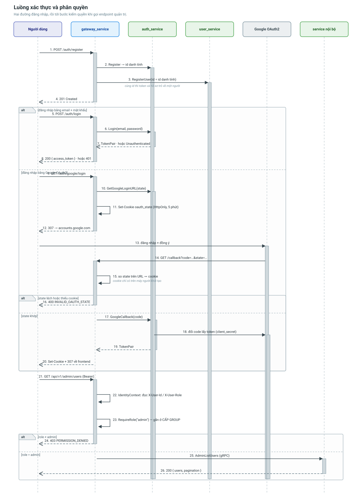

# Luồng xác thực và phân quyền

Từ lúc người dùng đăng nhập tới lúc một request chạm được endpoint quản trị.
Đi qua **auth_service** và lớp middleware của **gateway_service**.



---

## Nguyên tắc nền: ai ký, ai kiểm

Đây là điều cần nắm trước mọi thứ khác, vì toàn bộ phần còn lại là hệ quả của nó.

```
auth_service   giữ PRIVATE key   ->  KÝ token          (chỉ lúc đăng nhập)
gateway        giữ PUBLIC key    ->  VERIFY token      (mọi request)
service nội bộ giữ KHÔNG GÌ CẢ   ->  tin metadata gateway gửi xuống
```

Ba dòng trên nói ba điều:

**Gateway verify được nhưng không ký được.** Nó chỉ có public key. Gateway là thứ
phơi ra Internet, cũng là thứ dễ bị chiếm nhất; chiếm được nó, kẻ tấn công vẫn
không phát hành ra được một token admin nào.

Thuật toán đối xứng như HS256 không cho phép ranh giới này: verify và ký dùng
chung một secret, nên trao khả năng verify là trao luôn khả năng ký.

**Verify không chạm mạng.** Kiểm một chữ ký RS256 tốn khoảng **31µs**
(`BenchmarkVerifyAccess` trong `pkg/authn`). Phương án thay thế — gateway gọi
`VerifyToken` qua gRPC — tốn một round-trip **cộng** một truy vấn DB cho mỗi
request, và biến auth_service thành điểm chết của cả hệ thống.

**Service nội bộ không verify lại.** Chúng đọc danh tính từ gRPC metadata mà
gateway gửi xuống. Đánh đổi này chỉ đúng khi mạng nội bộ đóng kín — xem
[Điều kiện tiên quyết](#điều-kiện-tiên-quyết-mạng-nội-bộ-phải-đóng) bên dưới.

### Vì sao RS256 chứ không phải EdDSA

Ed25519 ký nhanh hơn RSA rất nhiều, nhưng tải của hệ thống này lệch hẳn về phía
verify: ký chỉ xảy ra lúc đăng nhập, verify xảy ra ở **mọi** request. RSA có số
mũ public nhỏ (65537) nên verify rất nhanh, đổi lại ký chậm (~1ms) — đúng chiều
ta cần. Chọn thuật toán theo hình dạng tải, không theo con số trong tiêu đề
benchmark.

### Sinh và triển khai khoá

```bash
make auth-keys
```

Lệnh này tạo `secrets/jwt_private.pem` và `secrets/jwt_public.pem`. Thư mục
`secrets/` nằm trong `.gitignore`.

`docker-compose.yml` mount chúng theo đúng ranh giới trên: private key **chỉ** vào
`auth-service`, public key **chỉ** vào `gateway-service`.

| Biến môi trường | Service | Nội dung |
|---|---|---|
| `AUTH_SERVICE_JWT_PRIVATE_KEY` | auth_service | private key (PEM, base64, hoặc đường dẫn file) |
| `GATEWAY_JWT_PUBLIC_KEY` | gateway | public key |
| `GATEWAY_JWT_PREVIOUS_PUBLIC_KEY` | gateway | khoá cũ, chỉ đặt trong lúc xoay khoá |

Khoá được nạp và kiểm **lúc khởi động**, không phải lúc có request đầu tiên. Cấu
hình sai thì service chết ngay khi deploy — chứ không phải khởi động xanh rồi mới
hỏng ở lần đăng nhập đầu, khi người dùng thật đang chờ và không ai nhìn log.

Đối chiếu hai bên có đang dùng đúng một cặp khoá không:

```bash
make auth-keys-show
```

Hai dấu vân tay in ra phải giống nhau. Khi lệch, triệu chứng là "mọi token bỗng
dưng không hợp lệ" — rất khó đoán ra nguyên nhân nếu không có lệnh này.

### Xoay khoá không gây gián đoạn

Token mang `kid` trong header, nên gateway giữ được nhiều khoá cùng lúc và chọn
đúng khoá theo từng token.

1. Sinh cặp mới vào một thư mục khác.
2. Đặt `GATEWAY_JWT_PREVIOUS_PUBLIC_KEY` = khoá **cũ**, `GATEWAY_JWT_PUBLIC_KEY` =
   khoá **mới**. Khởi động lại gateway. Lúc này nó chấp nhận cả hai.
3. Đổi `AUTH_SERVICE_JWT_PRIVATE_KEY` sang khoá mới. Khởi động lại auth_service.
4. Chờ hết thời hạn access token (15 phút) cộng thêm biên an toàn, rồi xoá
   `GATEWAY_JWT_PREVIOUS_PUBLIC_KEY`.

Thứ tự này quan trọng: gateway phải biết khoá mới **trước** khi auth_service bắt
đầu ký bằng nó. Làm ngược lại thì có một khoảng thời gian mọi lần đăng nhập đều
sinh ra token mà gateway từ chối.

---

## Hai đường vào

### Đường 1 — Email + mật khẩu

```
POST /api/v1/auth/login
{ "email": "...", "password": "..." }
```

auth_service kiểm mật khẩu, ký JWT, trả về:

```json
{
  "data": {
    "access_token": "...",
    "refresh_token": "...",
    "expires_at": 1735689600,
    "user": { "id": "3f2b7c10-...", "email": "...", "role": "driver" }
  }
}
```

`expires_at` là **mốc Unix tuyệt đối**, không phải khoảng thời gian còn lại.

Sai mật khẩu → gRPC `Unauthenticated` → gateway dịch thành **HTTP 401**
`UNAUTHENTICATED`.

Lưu ý về chống dò tài khoản: khi email không tồn tại, auth_service **vẫn** chạy
một lần bcrypt trên hash giả. Không có bước đó, email chưa đăng ký trả lời trong
~1ms còn email có thật mất ~250ms — chênh lệch đủ để dò xem địa chỉ nào đã đăng
ký, tức là cùng một rò rỉ, chỉ qua đồng hồ thay vì qua câu chữ.

### Đường 2 — Google OAuth2

```
GET /api/v1/auth/google/login      → redirect 307 sang Google
GET /api/v1/auth/google/callback   → đổi code lấy token, set cookie
```

Cơ chế chống CSRF bằng `state` + cookie được mô tả riêng ở
[Đăng nhập Google và chống CSRF](../architecture/oauth-google-flow.md).

---

## Vòng đời phiên

| Token | Thời hạn | Trạng thái | Thu hồi được? |
|---|---|---|---|
| access | 15 phút | không | không |
| refresh | 7 ngày | có (bảng `refresh_tokens`) | có |

Hai loại tồn tại song song chính vì cặp đánh đổi này. Access token không trạng
thái nên verify không chạm DB — đó là thứ cho phép hệ thống chịu tải; cái giá là
không thu hồi được, và ta trả giá đó bằng cách để nó sống ngắn.

### Làm mới

```
POST /api/v1/auth/refresh
{ "refresh_token": "..." }        # hoặc để trống nếu dùng cookie
```

Ba điều xảy ra ở đây, mỗi điều đều có lý do:

**Refresh token dùng một lần.** Mỗi lần gọi trả về một refresh token mới; token cũ
hết hiệu lực ngay.

**Vai trò được đọc lại từ DB**, không lấy từ token cũ. Nhờ vậy một người vừa bị hạ
quyền không tự gia hạn được vai trò cũ suốt 7 ngày. Cũng vì thế refresh token cố
tình **không mang** `role`.

**Dùng lại token bị phát hiện.** Nếu một refresh token đã đổi rồi mà xuất hiện lần
nữa, chắc chắn có hai bên đang cùng giữ nó — người dùng thật và kẻ lấy trộm.
Không biết bên nào là bên nào, nên hệ thống thu hồi **toàn bộ** phiên của người đó
và bắt đăng nhập lại. Đây là "refresh token rotation with reuse detection" trong
OAuth 2.0 Security BCP (RFC 9700).

| Trường hợp | Mã HTTP | Client nên làm gì |
|---|---|---|
| Access token hết hạn | 401 `TOKEN_EXPIRED` | Gọi `/auth/refresh` |
| Refresh token hỏng | 401 `UNAUTHENTICATED` | Đăng nhập lại |
| Phiên bị thu hồi | 403 `PERMISSION_DENIED` | Đăng nhập lại, **đừng** thử refresh |

Phân biệt 401 và 403 ở đây không phải chuyện câu chữ: trả nhầm mã là app rơi vào
vòng lặp refresh vô tận.

### Đăng xuất

```
POST /api/v1/auth/logout
```

Thu hồi phiên refresh. Access token đang cầm **vẫn sống** tới khi hết hạn (tối đa
15 phút) — cái giá cố hữu của token không trạng thái. Muốn cắt tức thì thì phải có
danh sách chặn theo `jti`, đổi lại mỗi request tốn một lượt đọc Redis.

---

## Gọi API sau khi có token

```
GET /api/v1/users/{user_id}
Authorization: Bearer <access_token>
```

hoặc qua cookie `access_token` (luồng OAuth đã set sẵn).

Cookie được đặt `HttpOnly`, `SameSite=Lax`, và `Secure` khi
`GLOBAL_IS_PRODUCTION=true`. `HttpOnly` là bắt buộc: cho JavaScript đọc token
biến một lỗ XSS bất kỳ thành chiếm tài khoản. App nào cần token trong JS thì đã
có nó trong body của response đăng nhập.

---

## Ba vòng bảo vệ ở gateway

Cây route chia làm ba nhánh, và ranh giới giữa chúng **là** ranh giới bảo mật:

```go
publicAuth := api.Group("/auth")                     // đăng ký, đăng nhập, refresh
secured    := api.Group("", auth.Required())         // mọi endpoint người dùng
admin      := api.Group("/admin", auth.Required(),
                        middleware.RequireRole(authn.RoleAdmin))
```

Gắn ở **cấp group** nghĩa là không thể "quên" bảo vệ một endpoint mới: khai báo
nó trong `secured` hay `admin` là đã được chặn sẵn.

### Vòng 1 — `StripClientIdentity`

Xoá `X-User-Id`, `X-User-Role`, `X-User-Email` do client gửi lên, **trước** khi
bất cứ thứ gì khác chạy.

Ba header này là kênh liên lạc NỘI BỘ giữa gateway và service phía sau. Giá trị
từ bên ngoài không có ý nghĩa gì và phải bị loại bỏ trước khi bất cứ thứ gì đọc
chúng — nếu không, một request như

```bash
curl -H "X-User-Role: admin" https://.../api/v1/admin/users
```

sẽ tự cấp cho mình vai trò quản trị.

Nginx **cũng** xoá chúng (`proxy_set_header X-User-Id "";`). Hai lớp là cố ý: lớp
ở nginx chặn sớm nhất có thể, lớp trong gateway vẫn đứng vững khi gateway được
triển khai sau một load balancer khác.

### Vòng 2 — `auth.Required()`

Verify chữ ký RS256, chốt cứng thuật toán, kiểm `iss`, kiểm hạn, kiểm loại token
là `access`. Rồi **ghi đè** — không phải đọc — các header danh tính.

Chốt thuật toán không phải chi tiết thừa. Không có nó, kẻ tấn công đổi header
thành `alg: none`, hoặc thành HS256 rồi ký bằng chính public key (vốn công khai)
của ta — và thư viện sẽ ngoan ngoãn chấp nhận. Cả hai đường tấn công đều có test
riêng trong `pkg/authn/authn_test.go`.

### Vòng 3 — `requireSelfOrAdmin`

Xác thực trả lời "anh là ai", **không** trả lời "anh được đụng vào cái gì". Vòng
thứ ba chặn việc thao tác lên dữ liệu của người khác:

```go
userID, ok := resolveOwnID(ctx, "user_id")
if !requireSelfOrAdmin(ctx, userID) { return }
```

Không có nó, bất kỳ tài xế nào đã đăng nhập cũng đọc được hồ sơ, sổ địa chỉ và
hộp thư của **mọi** người dùng khác — chỉ cần đổi id trên URL. Đây là IDOR, mục
đầu tiên trong OWASP API Security Top 10.

Cùng nguyên tắc ấy áp cho các trường lấy từ token thay vì từ body:

| Trường | Nguồn | Nếu lấy từ body thì sao |
|---|---|---|
| `driver_id` khi đăng ký xe | token | Đăng ký xe đứng tên tài xế khác |
| `driver_id` khi báo GPS | token | Giả vị trí của tài xế khác |
| `reviewer_id` khi duyệt KYC | token | Ghi tên người khác vào nhật ký kiểm toán |
| `user_id` khi đăng ký thiết bị | token | Nhận toàn bộ push của người khác |

---

## Điều kiện tiên quyết: mạng nội bộ phải đóng

Service nội bộ **không** verify token. Chúng đọc danh tính từ gRPC metadata:

```
x-user-id     -> uuid của người gọi
x-user-role   -> vai trò
x-user-email  -> email
```

Ba lý do không chuyển tiếp cả token xuống dưới, xếp theo mức quan trọng:

1. Mỗi service tự verify nghĩa là sáu chỗ cùng phải nhớ chốt thuật toán, chốt
   issuer, chốt loại token — sáu chỗ có thể làm sai theo sáu cách khác nhau.
2. Verify tốn ~31µs, nhân với số service một request đi qua.
3. Token có hạn riêng; một chuỗi gọi dài có thể chạm mốc hết hạn ở giữa đường,
   làm request thất bại một nửa — dạng lỗi rất khó tái hiện.

Đổi lại, mô hình này đặt cược vào một giả định **phải** được giữ đúng ở tầng hạ
tầng: **không service nội bộ nào publish cổng gRPC ra ngoài**. Nếu một ngày cổng
bị mở, bất kỳ ai cũng gọi thẳng vào và tự khai mình là admin.

Trong `docker-compose.yml`, chỉ `gateway-service` có ánh xạ cổng ra máy chủ. Sáu
service nội bộ chỉ nghe trong mạng `logistic_net`.

Ở tầng nghiệp vụ, các service vẫn kiểm quyền sở hữu như một lớp nữa:

| Kiểm tra | Mã lỗi |
|---|---|
| Địa chỉ có thuộc về user này không | `ADDRESS_NOT_OWNED` |
| Thiết bị có thuộc về user này không | `DEVICE_NOT_OWNED` |
| Xe có thuộc về tài xế này không | `VEHICLE_NOT_OWNED` |
| Thông báo có thuộc về user này không | `NOTIFICATION_NOT_OWNED` |

---

## Một không gian định danh duy nhất

`sub` trong token là **UUID v7 của user**, cùng không gian với user_service và mọi
service khác.

Một id chỉ có nghĩa trong phạm vi service phát hành ra nó thì không dùng được ở
nơi khác: gateway nhận `sub` từ token rồi chuyển xuống user_service, vehicle_service
và notification_service, nên cả bốn phải cùng một không gian định danh.

`pkg/authn` từ chối token có `sub` không phải UUID (`TestSubjectMustBeUUID`).

---

## Những gì được test tự động

`gateway_service/internal/delivery/http/auth_guard_test.go` khoá các bất biến của
lớp xác thực:

| Test | Chặn điều gì |
|---|---|
| `TestForgedRoleHeaderCannotReachAdmin` | Header danh tính tự khai đi tới nhóm admin |
| `TestDriverTokenCannotReachAdmin` | Token thật nhưng sai vai trò |
| `TestSecuredRoutesRejectAnonymous` | Endpoint người dùng để hở |
| `TestGarbageTokenRejected` | Token hỏng bị coi như khách vãng lai |
| `TestNoUnintentionallyPublicRoute` | Route mới khai nhầm vào nhóm công khai |

Test cuối là chốt chặn cấu trúc: nó duyệt **mọi** route dưới `/api/v1` và bắt
buộc route nào không nằm trong danh sách công khai đều phải trả 401 khi không có
token. Khai một route vào nhầm nhóm là lỗi khó thấy khi đọc: cây route vẫn trông
hợp lý, và không có dấu hiệu nào cho tới lúc dữ liệu ra ngoài.

`pkg/authn/authn_test.go` phủ phía thuật toán: alg confusion, `alg=none`, token ký
bằng khoá lạ, token hết hạn, sai issuer, refresh dùng thay access, khoá dưới 2048
bit, và xoay khoá.

---

## Liên quan

- [auth_service](../services/auth-service.md)
- [gateway_service](../services/gateway-service.md)
- [Đăng nhập Google và chống CSRF](../architecture/oauth-google-flow.md)
- [Quan sát hệ thống (OpenTelemetry)](../architecture/observability.md)
