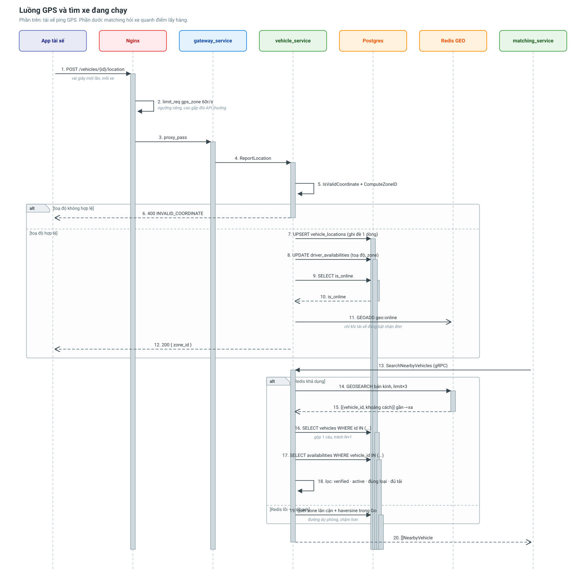

# Luồng GPS và tìm xe đang chạy

Từ lúc app tài xế ping toạ độ tới lúc matching_service nhận về danh sách xe phù
hợp. Đây là luồng **nóng nhất** hệ thống: chạy vài giây một lần cho mỗi xe.



---

## Vì sao luồng này cần thiết kế riêng

Hai con số quyết định mọi thứ:

- Tài xế ping GPS **vài giây một lần**, nhân với hàng nghìn xe.
- Mỗi đơn hàng mới cần **một lần tìm kiếm** quanh điểm lấy hàng.

Nghĩa là bảng vị trí vừa bị ghi liên tục vừa bị đọc để tìm kiếm. Nếu để Postgres
gánh cả hai, mỗi lần tìm là một lần quét chỉ mục không gian trên một bảng đang
nóng — đúng công thức tạo nút thắt cổ chai.

---

## Phần ghi: tài xế báo vị trí

```
POST /api/v1/vehicles/{id}/location
{ "latitude": 10.7721, "longitude": 106.6980, "heading": 45, "speed_kph": 35 }
```

### Nginx: ngưỡng riêng cho GPS

```nginx
location ~ ^/api/v1/vehicles/[^/]+/location$ {
    limit_req zone=gps_zone burst=120 nodelay;   # 60r/s
}
```

Dùng chung ngưỡng với API thường (30r/s) sẽ chặn nhầm tài xế đang chạy thật.

### vehicle_service: kiểm tra rồi ghi

1. **Chặn toạ độ rác** — `(0,0)` giữa Đại Tây Dương, `NaN`, giá trị ngoài ngưỡng.
   Một điểm sai đưa vào Redis GEO sẽ kéo lệch cả kết quả tìm kiếm.
2. Tính `zone_id` (ô lưới 0.05°, xấp xỉ 5.5 km).
3. Ghi đè `vehicle_locations` — **một dòng cho mỗi xe**, không lưu lịch sử.
4. Đồng bộ toạ độ sang `driver_availabilities` để matching đọc một chỗ là đủ.
5. **Chỉ khi tài xế đang bật nhận đơn** mới `GEOADD` vào Redis.

Bước 5 quan trọng: tài xế tắt máy vẫn có thể tiếp tục gửi GPS (app chạy nền), và
ta không muốn những xe đó lọt vào kết quả tìm kiếm.

### Thứ tự Postgres trước, Redis sau

Ghi Redis trước mà Postgres hỏng thì chỉ mục chứa một xe mà bảng vị trí không hề
biết tới. Ngược lại thì tệ nhất là chỉ mục chậm hơn DB đúng một nhịp ping.

---

## Phần đọc: tìm xe quanh một điểm

```
POST /api/v1/vehicles/nearby
{ "latitude": 10.7721, "longitude": 106.6980, "radius_km": 5,
  "min_weight_kg": 1200, "vehicle_type": "truck", "limit": 50 }
```

matching_service gọi API này thay vì tự truy vấn — nhờ vậy chỉ có **một nơi** biết
chỉ mục vị trí được lưu ở đâu và theo định dạng gì.

### Ba bước

```
1. GEOSEARCH  → vehicle_id + khoảng cách, đã sắp gần → xa   (lấy dư ×3)
2. Hai truy vấn GỘP xuống Postgres: thông tin xe + sức chứa trống
3. Lọc: đã duyệt · đang active · đúng loại xe · đủ tải · đủ khối
```

**Vì sao lọc ở bước 3 chứ không bước 1?** Redis GEO chỉ biết toạ độ, không biết xe
còn trống bao nhiêu. Ta cố tình lấy dư ở bước 1 để sau khi loại bớt vẫn còn đủ số
lượng người gọi yêu cầu.

**Vì sao hai truy vấn gộp?** Redis trả về 50 `vehicle_id`; gọi `GetVehicleByID` 50
lần là 50 vòng đi-về xuống DB. `IDIn(...)` gộp thành một câu.

### Tham số bị kẹp

| Tham số | Mặc định | Trần |
|---|---|---|
| `radius_km` | 5 | 100 |
| `limit` | 50 | 200 |

Không kẹp thì một request `radius_km=100000` bắt Redis quét toàn bộ chỉ mục.

---

## Khi Redis chết

Rơi về đường dự phòng, hoàn toàn tự động:

1. Tính các ô lưới lân cận (`zone_id` hiện tại + 8 ô xung quanh).
2. Quét `driver_availabilities` với `is_online = true` và `zone_id IN (...)`.
3. Tính haversine trong Go, lọc theo bán kính, sắp xếp.

Chậm hơn đáng kể, nhưng **hệ thống vẫn ghép được đơn** — và đó mới là điều quan trọng.

Bán kính lớn thì số ô tăng theo bình phương, nên có trần 2 ô mỗi chiều (tối đa 25
ô); quá ngưỡng thì quét không lọc zone.

---

## Xe phải rời chỉ mục khi nào

Đây là danh sách **phải đủ**, thiếu một mục là matching gán đơn cho xe nằm garage:

| Sự kiện | Hành động |
|---|---|
| Tài xế tắt nhận đơn | `ZREM` |
| Xe chuyển `maintenance` / `inactive` | `ZREM` |
| Admin từ chối duyệt xe | `ZREM` |
| Xe bị xoá | `ZREM` |
| Member rác trong chỉ mục (xe đã xoá khỏi DB) | Dọn ngay khi phát hiện lúc tìm kiếm |

Cả bốn mục đầu đều có test tích hợp chạy trên Redis thật.

---

## Liên quan

- [vehicle_service](../services/vehicle-service.md)
- [matching_service](../services/matching-service.md)
- [Luồng tài xế gia nhập hệ thống](driver-onboarding-flow.md)
