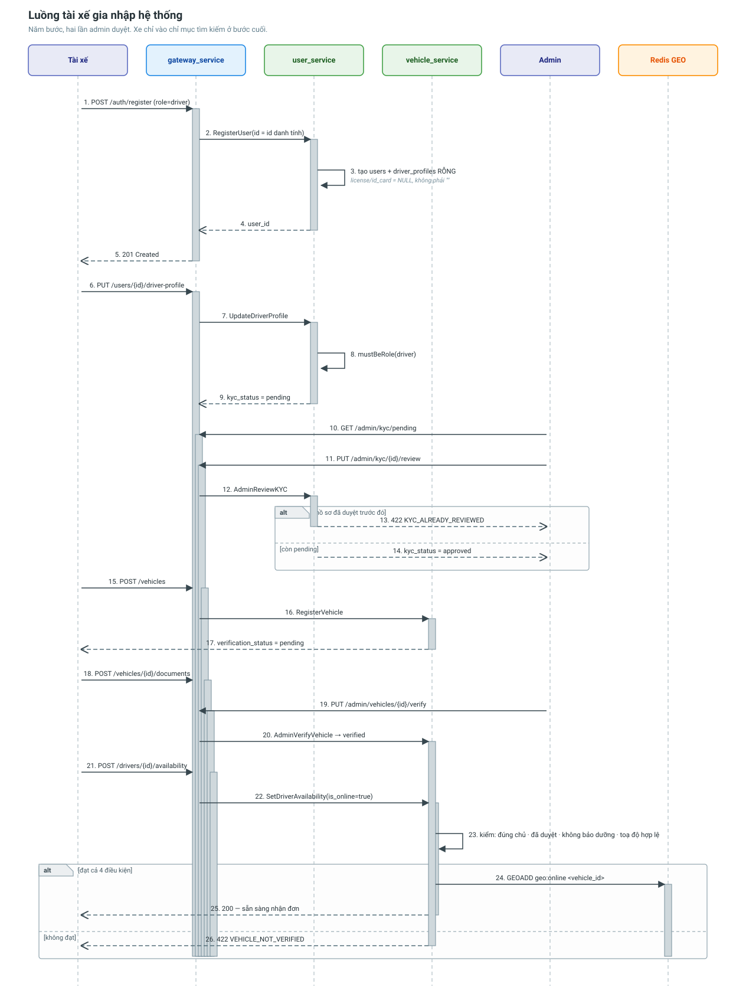

# Luồng tài xế gia nhập hệ thống

Từ lúc cài app tới lúc chiếc xe đầu tiên xuất hiện trong kết quả tìm kiếm của
matching. Đi qua **user_service**, **vehicle_service**, và hai lần duyệt của admin.



---

## Vì sao có tận bốn cửa kiểm duyệt

Một chiếc xe được phép nhận đơn nghĩa là hệ thống đang đảm bảo với chủ hàng rằng:
người lái có thật, có bằng, xe có thật, và giấy tờ xe còn hạn. Mỗi cửa kiểm một
việc, và **bỏ qua bất kỳ cửa nào cũng đẩy rủi ro sang chủ hàng**.

---

## Bước 1 — Đăng ký tài khoản

```
POST /api/v1/auth/register
{ "email": "...", "password": "...", "role": "driver", "full_name": "...", "phone": "0901234567" }
```

`auth_service` cấp danh tính, rồi gateway gọi `user_service.RegisterUser` với
**đúng id đó**. Cùng một id thì `sub` trong token và hồ sơ nghiệp vụ trỏ về một
người; nếu hai bên tự sinh id riêng thì mọi `/api/v1/users/*` sau đó trả 404 hoặc
403. `phone` khai muộn cũng được, bổ sung sau bằng `PUT /api/v1/users/{id}`.

`user_service` tạo dòng trong `users` **và** một `driver_profiles` rỗng.

Hồ sơ phụ được tạo rỗng ngay lúc này để mọi API sau đó có chỗ ghi vào, khỏi phải
xử lý riêng trường hợp "user có mà hồ sơ chưa có".

Lúc này `license_number` và `id_card` là **NULL** chứ không phải chuỗi rỗng — hai
cột đó UNIQUE, để rỗng thì tài xế thứ hai đăng ký sẽ vi phạm ràng buộc.

## Bước 2 — Nộp hồ sơ KYC

```
PUT /api/v1/users/{user_id}/driver-profile
{ "license_number": "B2-123456", "id_card": "079..." }
```

Trước khi ghi, `mustBeRole` kiểm tra tài khoản này đúng là `driver`. Không có bước
đó thì gọi nhầm trên tài khoản chủ hàng sẽ trả về "không tìm thấy hồ sơ" — một câu
vừa sai nguyên nhân vừa khiến client đi dò mò.

Hồ sơ vào hàng đợi `kyc_status = pending`.

## Bước 3 — Admin duyệt KYC

```
GET /api/v1/admin/kyc/pending           # hàng đợi, ai nộp trước xét trước
PUT /api/v1/admin/kyc/{user_id}/review  { "approved": true, "note": "..." }
```

Hồ sơ đã duyệt rồi thì **không cho duyệt lại** (`KYC_ALREADY_REVIEWED`). Một cú
bấm nhầm sẽ lật ngược quyết định cũ mà không để lại dấu vết ai đã đổi.

Ghi lại `kyc_reviewed_by` và `kyc_reviewed_at`.

## Bước 4 — Đăng ký xe

```
POST /api/v1/vehicles
{ "license_plate": "51C-12345", "vehicle_type": "truck",
  "capacity_weight_kg": 10000, "capacity_volume_cbm": 40 }
```

Sức chứa bằng 0 bị từ chối (`INVALID_CAPACITY`) — sức chứa 0 làm mọi phép so khớp
tải trọng về sau trở nên vô nghĩa.

Xe được tạo với `verification_status = pending`.

## Bước 5 — Nộp giấy tờ xe

```
POST /api/v1/vehicles/{id}/documents
{ "document_type": "inspection", "file_url": "https://res.cloudinary.com/..." }
```

`file_url` lấy từ `media_service` (`POST /api/v1/media/upload`). vehicle_service
chỉ lưu đường dẫn, không giữ file.

Bốn loại giấy tờ: `registration`, `inspection`, `insurance`, `license`.
Cột `expires_at` cho phép hệ thống chủ động nhắc trước khi giấy tờ hết hạn.

## Bước 6 — Admin duyệt xe

```
GET /api/v1/admin/vehicle-documents/pending
PUT /api/v1/admin/vehicle-documents/{id}/review  { "approved": true }
PUT /api/v1/admin/vehicles/{id}/verify           { "approved": true }
```

Duyệt giấy tờ và duyệt xe là hai thao tác riêng: giấy tờ đủ mới nên đặt xe sang
`verification_status = verified`.

Nếu admin **từ chối** xe, xe bị gỡ khỏi chỉ mục Redis GEO ngay lập tức.

## Bước 7 — Bật nhận đơn

```
POST /api/v1/drivers/{driver_id}/availability
{ "vehicle_id": "...", "is_online": true,
  "current_lat": 10.7721, "current_lng": 106.6980 }
```

Đây là **chốt chặn quan trọng nhất** của toàn bộ luồng matching. Kiểm đủ năm
điều kiện trước khi cho lên online — KYC do gateway kiểm vì hồ sơ nằm ở
user_service, bốn cái còn lại do vehicle_service tự kiểm:

| Điều kiện | Lỗi trả về nếu sai |
|---|---|
| Xe thuộc về đúng tài xế này | `VEHICLE_NOT_OWNED` |
| `verification_status = verified` | `VEHICLE_NOT_VERIFIED` |
| `kyc_status = approved` | `KYC_NOT_APPROVED` |
| `status ≠ maintenance` | `VEHICLE_IN_MAINTENANCE` |
| Toạ độ hợp lệ (không phải 0,0 hay NaN) | `INVALID_COORDINATE` |

Không khai sức chứa còn trống thì mặc định lấy toàn bộ sức chứa xe; khai vượt quá
sức chứa thật thì bị **kẹp xuống** — không cho khai khống.

Đạt hết thì xe được `GEOADD` vào chỉ mục Redis và bắt đầu xuất hiện trong kết quả
`SearchNearbyVehicles`.

---

## Điều gì có thể sai

| Tình huống | Hệ thống xử lý |
|---|---|
| Hai tài xế cùng số bằng lái | UNIQUE index chặn, trả `LICENSE_ALREADY_USED` |
| Tài xế bật online khi xe chưa duyệt | Chặn ở biz, không vào chỉ mục |
| Redis chết lúc bật online | Ghi Postgres vẫn thành công; chỉ mục thiếu xe cho tới khi Redis quay lại |
| Tài xế tắt app nhưng vẫn ping GPS | Chỉ đồng bộ toạ độ khi `is_online = true`; xe offline không lọt vào kết quả |

---

## Liên quan

- [user_service](../services/user-service.md)
- [vehicle_service](../services/vehicle-service.md)
- [Luồng GPS và tìm xe đang chạy](driver-location-flow.md)
