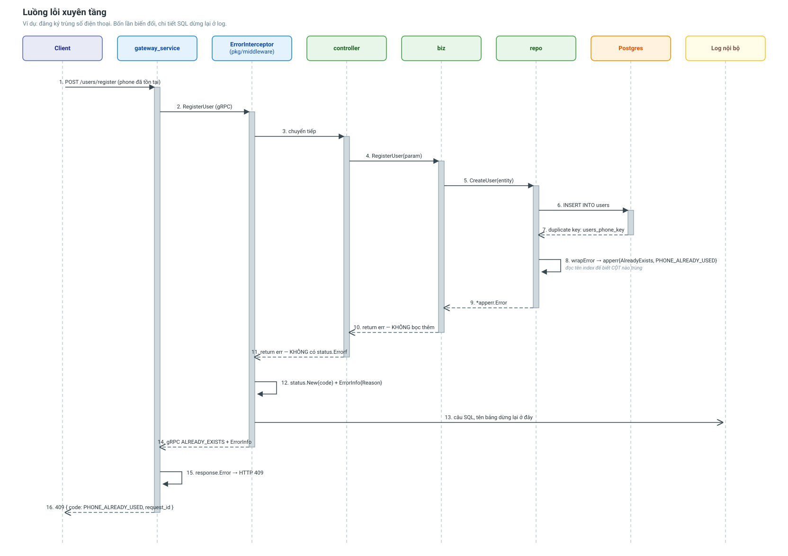

# Luồng lỗi xuyên tầng

Một lỗi từ Postgres đi tới trình duyệt phải qua **bốn lần biến đổi**. Tài liệu này
mô tả từng lần, và vì sao chúng cần thiết.



---

## Vấn đề của cách làm cũ

Trước đây mỗi controller tự viết:

```go
st, _ := status.FromError(err)
ctx.JSON(http.StatusInternalServerError, gin.H{
    "error": "registration_failed", "message": st.Message(),
})
```

Ba hệ quả:

1. **Mọi lỗi đều ra HTTP 500** — kể cả "không tìm thấy user" hay "sai mật khẩu".
2. **Mã lỗi do từng người tự nghĩ ra** (`registration_failed`, `fetch_failed`,
   `upload_failed`) nên client không thể xử lý theo mã một cách đáng tin.
3. **Chi tiết kỹ thuật lọt ra ngoài** — `st.Message()` có thể chứa nguyên văn câu
   `duplicate key value violates unique constraint "users_phone_key"`, để lộ tên
   bảng và tên cột cho bất kỳ ai gọi API.

---

## Bốn lần biến đổi

### 1. dao → apperr (tầng repo)

`repo/repo_error.go` là **ranh giới**. Từ đây trở lên không ai còn phải biết
`*ent.NotFoundError` trông như thế nào.

```go
func wrapError(err error, notFound *apperr.Error) error {
    if ent.IsNotFound(err)        { return notFound.WithCause(err) }
    if ent.IsConstraintError(err) { return mapConstraint(err) }   // đọc tên index
    // context.Canceled, DeadlineExceeded, ValidationError, NotSingular…
    return cerr.ErrDatabase.WithCause(err)
}
```

`mapConstraint` đọc tên constraint trong thông báo lỗi để biết **cột nào** bị
trùng — Postgres nhét tên index vào message (`users_phone_key`), nên khớp chuỗi là
cách duy nhất mà không phải cài thêm driver-specific error parsing.

Kết quả là một `*apperr.Error` mang bốn thứ:

| Trường | Vai trò |
|---|---|
| `Kind` | Quyết định gRPC code và HTTP status |
| `Code` | Mã máy đọc được, ổn định (`PHONE_ALREADY_USED`) |
| `Message` | Câu chữ **đã an toàn** để lộ ra ngoài |
| `cause` | Lỗi gốc — giữ để log, KHÔNG trả ra ngoài |

### 2. biz và controller: không làm gì cả

Đây là phần dễ bị hiểu nhầm nhất. Cả hai tầng chỉ `return err`:

```go
dp, err := c.engine.UpdateDriverKYC(ctx, &param)
if err != nil {
    return nil, err          // không bọc, không dịch, không log
}
```

Nhờ vậy 21 hàm trong `user_controller.go` không có lấy một dòng `status.Errorf`.

### 3. apperr → gRPC status (interceptor)

`pkg/middleware.ErrorInterceptor` là **chốt chặn cuối** trước khi lỗi rời service:

```go
st := status.New(appErr.GRPCCode(), appErr.Message)
st, _ = st.WithDetails(&errdetails.ErrorInfo{
    Reason:   appErr.Code,      // PHONE_ALREADY_USED
    Domain:   serviceName,
    Metadata: appErr.Details,
})
```

Ba nhánh xử lý:

| Loại lỗi | Xử lý |
|---|---|
| `*apperr.Error` | Dùng `Kind`/`Code` của nó |
| Đã là gRPC status | Giữ nguyên (lỗi vọng lên từ service khác) |
| Lỗi lạ | `codes.Internal` + câu chữ chung chung, **log full lỗi gốc** |

Nhánh thứ ba là điểm bảo mật: lỗi không xác định **không** được trả nguyên văn ra
ngoài.

Chỉ lỗi `KindInternal` mới log ở mức báo động — lỗi 404/400 là chuyện bình thường.

### 4. gRPC status → HTTP (gateway)

`gateway/internal/response.Error()` bóc ba lớp theo thứ tự ưu tiên:

1. `errdetails.ErrorInfo` → mã lỗi nghiệp vụ + metadata.
2. gRPC code → HTTP status.
3. `Message` → câu chữ hiển thị.

```json
{
  "error": {
    "code": "PHONE_ALREADY_USED",
    "message": "số điện thoại đã được đăng ký",
    "details": { "phone": "0901234567" }
  },
  "request_id": "018f7c2e-..."
}
```

Service không gắn `ErrorInfo` (ví dụ lỗi từ chính tầng gRPC: mất kết nối, quá hạn)
thì dùng mã dự phòng suy ra từ gRPC code.

---

## Bảng dịch đầy đủ

| `apperr.Kind` | gRPC code | HTTP |
|---|---|---|
| `InvalidArgument` | `InvalidArgument` | 400 |
| `Unauthenticated` | `Unauthenticated` | 401 |
| `PermissionDenied` | `PermissionDenied` | 403 |
| `NotFound` | `NotFound` | 404 |
| `AlreadyExists` | `AlreadyExists` | 409 |
| `Conflict` | `Aborted` | 409 |
| `FailedPrecondition` | `FailedPrecondition` | 422 |
| `ResourceExhausted` | `ResourceExhausted` | 429 |
| `Unavailable` | `Unavailable` | 503 |
| `Timeout` | `DeadlineExceeded` | 504 |
| `Internal` | `Internal` | 500 |

Bảng này được khoá bằng test: `TestKindMapping` kiểm cả vòng tròn
`Kind → gRPC → HTTP` cho ra cùng kết quả với `Kind → HTTP`, để cùng một lỗi không
ra hai status khác nhau tuỳ việc nó đi thẳng hay qua dây gRPC.

---

## Panic

Không đi theo đường trên. `RecoveryInterceptor` (gRPC) và `middleware.Recovery`
(gateway) bắt panic, log kèm stack trace, trả 500 có cấu trúc.

Thứ tự interceptor có ý nghĩa:

```
Recovery  → ngoài cùng, bắt được cả panic của Logging và Error
Logging   → method + code + thời gian
Error     → sát handler nhất, là thứ cuối cùng chạm vào error
```

---

## Sentinel dùng chung

Mỗi service có một file liệt kê **toàn bộ** lỗi nghiệp vụ của mình
(`internal/common/errors/sentinel.go`). Gom vào một chỗ để:

- Không có hai nơi cùng định nghĩa "user không tồn tại" với hai câu chữ khác nhau.
- Đọc file đó là biết service có thể hỏng theo những cách nào.
- `Code` trở thành hợp đồng ổn định — app mobile switch theo `USER_NOT_FOUND`
  chứ không theo câu tiếng Việt.

Các sentinel là biến package-level **dùng chung**, nên `WithDetail`/`WithMessage`
trả về **bản sao** thay vì sửa tại chỗ. Sửa tại chỗ thì một request thêm detail sẽ
làm bẩn sentinel cho mọi request sau đó — kiểu lỗi rất khó lần ra. Có test riêng
cho điểm này.

---

## Liên quan

- [gateway_service](../services/gateway-service.md)
- [Tổng quan hệ thống](../architecture/system-overview.md)
