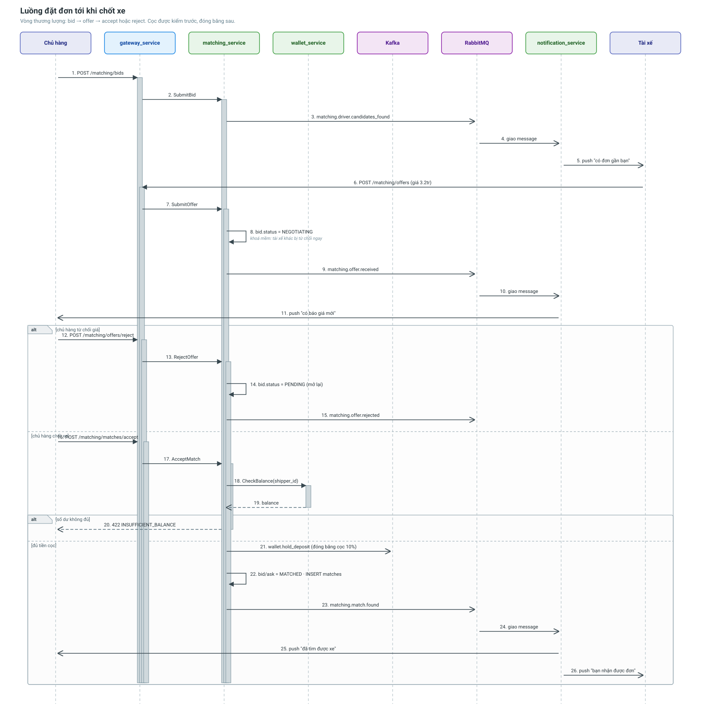

# Luồng chủ hàng đặt đơn tới khi chốt xe

Vòng đời một đơn hàng: đăng đơn → tài xế báo giá → chủ hàng chốt hoặc từ chối.
Đi qua **matching_service**, **vehicle_service**, **wallet_service** và
**notification_service**.



---

## Bước 1 — Chủ hàng đăng đơn

```
POST /api/v1/matching/bids
{ "shipper_id": "...", "origin": {...}, "destination": {...},
  "weight_kg": 1200, "volume_m3": 8.5, "max_price": 3500000 }
```

`SubmitBid` làm ba việc, theo đúng thứ tự này:

1. Tính `zone_id` từ toạ độ điểm lấy hàng (`GeoHashEngine`).
2. Ghi `bids` với `status = PENDING`.
3. `FindAskForBid` — tìm các chuyến rỗng phù hợp trong cùng zone, còn đủ tải và
   đủ khối, giá tối thiểu không vượt `max_price`.

Có tài xế phù hợp thì phát `matching.driver.candidates_found` qua RabbitMQ.

**Ghi DB trước, phát sự kiện sau.** Nếu phát trước mà ghi hỏng thì tài xế nhận
thông báo về một đơn hàng không tồn tại.

## Bước 2 — Tài xế nhận thông báo

notification_service tiêu thụ sự kiện và sinh **một thông báo cho mỗi tài xế**
trong danh sách, kèm khoảng cách:

> *"Có đơn hàng phù hợp gần bạn — 1200 kg / 8.5 m³, cách bạn 2.4 km, giá tối đa
> 3.500.000 đ"*

Kênh `push`, vì đây là loại thông báo cần đánh thức tài xế đang lái xe.

Chi tiết phần này: [Luồng ghép xe và thông báo](matching-notification-flow.md).

## Bước 3 — Tài xế báo giá

```
POST /api/v1/matching/offers
{ "bid_id": "...", "ask_id": "...", "desired_price": 3200000 }
```

`SubmitOffer` không đổi trạng thái ngay: nó đẩy báo giá lên NATS JetStream ở
subject `matching.offers.{bid_id}`. Consumer đọc ra rồi gọi `ProcessOfferQueue`,
và chính bước đó chuyển `bid.status` từ `PENDING` sang `NEGOTIATING`.

Đi vòng qua hàng đợi để nhiều báo giá cho cùng một đơn được xử lý tuần tự — ai
vào trước thắng.

Đây là **khoá mềm**: tài xế thứ hai ra giá cho cùng đơn sẽ nhận
`matching.drivers.rejected` ngay lập tức ("đơn đang được thương lượng") thay vì
chờ vô vọng.

Chủ hàng nhận `matching.offer.received`.

## Bước 4a — Chủ hàng từ chối

```
POST /api/v1/matching/offers/reject
{ "bid_id": "...", "ask_id": "...", "reason": "..." }
```

`bid` quay lại `PENDING`, các tài xế khác tiếp tục ra giá được. Tài xế bị từ chối
nhận `matching.offer.rejected`.

Không đọc được `ask` ở bước này **không** phải lỗi chí mạng: đơn đã được mở lại
rồi, chỉ mất phần báo cho tài xế. `ask.DriverID` vì vậy chỉ được đọc bên trong
nhánh đã kiểm lỗi — có test khoá điều kiện này.

## Bước 4b — Chủ hàng chốt xe

```
POST /api/v1/matching/matches/accept
{ "bid_id": "...", "ask_id": "...", "shipper_signature": "..." }
```

`AcceptOffer` chạy dưới khoá `mu`, theo trình tự:

1. Kiểm `bid.status = NEGOTIATING` — không thì từ chối (`BID_NOT_NEGOTIATING`).
2. Kiểm `ask_id` đúng là chuyến đã báo giá (`OFFER_ASK_MISMATCH`). Thiếu bước này
   thì chủ hàng chốt được với tài xế chưa từng ra giá.
3. Đối chiếu `consensus_price` client gửi với giá đã lưu (`PRICE_MISMATCH`). Giá
   chuẩn là giá server ghi lại lúc vào thương lượng, số client gửi chỉ để xác
   nhận — không bao giờ lấy làm giá chốt.
4. Dựng `MatchContract`, tiền cọc = 10% giá chốt.
5. **`CheckBalance`** sang wallet_service.
6. Không đủ tiền → dừng, trả `INSUFFICIENT_BALANCE`.
7. Đủ tiền → phát Kafka `wallet.hold_deposit` để đóng băng cọc (bất đồng bộ).
8. Ghi `matches` **trước**, rồi mới đặt `bid.status = MATCHED` và
   `ask.status = MATCHED`. Ngược thứ tự thì một lỗi lúc ghi hợp đồng sẽ để cả đơn
   lẫn chuyến ở trạng thái đã ghép mà không có hợp đồng nào.
9. Phát `matching.match.found` qua RabbitMQ.

**Vì sao kiểm tra số dư trước rồi mới phát Kafka?** Phát một khoản `HoldDeposit`
chắc chắn sẽ bị từ chối vì thiếu tiền chỉ tạo rác trong topic và một giao dịch lỗi
phải dọn.

## Bước 5 — Cả hai bên nhận thông báo

Một sự kiện `matching.match.found` sinh **hai** bản ghi thông báo:

| Người nhận | Nội dung |
|---|---|
| Chủ hàng | *"Đã tìm được xe cho đơn hàng của bạn. Giá chốt 3.200.000 đ, đặt cọc 320.000 đ."* |
| Tài xế | *"Bạn vừa nhận được một đơn hàng. Mở app để xem điểm lấy hàng."* |

Hai câu chữ **khác nhau** — có test khẳng định điều này, vì cùng nội dung cho hai
vai trò là dấu hiệu code chỉ nhân bản một bản ghi.

---

## Điều gì có thể sai

| Tình huống | Hệ thống xử lý |
|---|---|
| Hai tài xế ra giá cùng lúc | Khoá `mu` + kiểm `status`, người sau nhận "đã có người thương lượng" |
| Chủ hàng không đủ tiền cọc | Dừng ở bước 6, `bid` vẫn ở `NEGOTIATING` |
| wallet_service chưa dựng | matching thăm dò kết nối lúc khởi động, không nối được thì dùng ví giả lập (mọi lần kiểm số dư đều đạt) và ghi log cảnh báo — **hiện tại đúng là tình trạng này** |
| RabbitMQ chết | `NoopNotifier`, đơn vẫn chốt được, chỉ mất thông báo |
| Kafka chết | `HoldDeposit` không tới wallet; hợp đồng đã ghi nhưng cọc chưa đóng băng — **điểm yếu đã biết, cần outbox pattern** |

---

## Liên quan

- [matching_service](../services/matching-service.md)
- [Luồng ghép xe và thông báo](matching-notification-flow.md)
- [wallet_service](../services/wallet-service.md)
