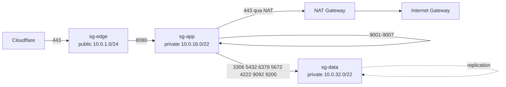

# Từ mạng trần tới VPC: chia mạng và tổ chức EC2

Tài liệu này là **lộ trình đi sâu**, nối tiếp hai tài liệu đã có:

| Đã có | Vai trò | Tài liệu này bổ sung gì |
|---|---|---|
| [networking.md](networking.md) | OSI, đóng gói, NAT, TLS, firewall | Cơ chế *quyết định* của gói tin: ARP next-hop, longest prefix match, MTU, conntrack |
| [aws-architecture.md](aws-architecture.md) | Ảo hoá, vì sao có VPC | Luật chơi riêng của VPC, con số giới hạn, quy hoạch CIDR, xếp workload |

Bốn phần đi theo đúng thứ tự học:

```
Phần 1  Mạng trần      → gói tin thật sự được quyết định đi đâu như thế nào
Phần 2  Chia mạng      → toán nhị phân thành kỹ năng cơ khí, làm được trong 30 giây
Phần 3  VPC            → AWS giữ lại gì, lấy đi gì, thêm gì so với mạng trần
Phần 4  Vận dụng       → quy hoạch CIDR + xếp EC2 cho chính hệ logistic này
```

Nguyên tắc đọc: **mỗi khái niệm ở Phần 3 đều phải trỏ ngược được về một khái niệm ở
Phần 1**. Nếu không trỏ ngược được thì bạn đang học thuộc lòng tên dịch vụ AWS chứ
chưa hiểu mạng.

---

# PHẦN 1 — MẠNG TRẦN (BARE BARE)

## 1.1. Ba câu hỏi mà mọi máy phải trả lời trước khi gửi 1 byte

Khi ứng dụng gọi `connect("10.0.32.11:5432")`, kernel không hề "gửi tới 10.0.32.11".
Nó lần lượt trả lời ba câu hỏi, đúng thứ tự này:

1. **Đích có cùng mạng với tôi không?** → phép AND giữa IP đích và subnet mask.
2. **Nếu khác mạng, tôi phải đưa gói cho AI (next-hop)?** → tra bảng định tuyến.
3. **Cái next-hop đó có MAC là gì?** → ARP.

Ba câu hỏi này là toàn bộ Layer 3 forwarding. Mọi thứ trong VPC ở Phần 3 chỉ là AWS
trả lời hộ bạn ba câu này bằng phần mềm.

## 1.2. Broadcast domain — đơn vị thật của "một mạng"

"Một mạng" không phải là một dải IP. Nó là **một miền quảng bá**: tập các thiết bị mà
khi một máy hét lên (frame đích `ff:ff:ff:ff:ff:ff`) thì tất cả đều nghe thấy.

- Switch = **một** broadcast domain trên tất cả các cổng (trừ khi cắt bằng VLAN).
- Router = **ranh giới** broadcast domain. Router không bao giờ chuyển tiếp broadcast.

Hệ quả trực tiếp — đây là lý do kỹ thuật khiến ta phải chia subnet, chứ không phải vì
"cho gọn":

| Số máy trong 1 broadcast domain | Chuyện gì xảy ra |
|---|---|
| 200 (`/24`) | ARP lai rai, không ai để ý |
| 4000 (`/20`) | ARP + mDNS + DHCP bắt đầu ăn CPU của mọi máy |
| 65000 (`/16`) | Broadcast storm: mọi NIC phải ngắt CPU để đọc rác của người khác |

Và hệ quả bảo mật: **trong cùng broadcast domain, hai máy nói chuyện không qua router,
nên không qua firewall nào cả**. Con DB và con máy nhân viên nằm chung `/16` nghĩa là
không có gì chặn được lây lan ngang (lateral movement).

## 1.3. ARP giải địa chỉ NEXT-HOP, không phải địa chỉ đích

Đây là chỗ hay bị hiểu sai nhất. Khi máy `192.168.1.5` gửi gói tới `8.8.8.8`:

```
ARP request KHÔNG hỏi "ai là 8.8.8.8"
ARP request hỏi "ai là 192.168.1.1"   ← default gateway, tức next-hop
```

Frame gửi đi có:

| Trường | Giá trị |
|---|---|
| MAC nguồn | MAC của máy bạn |
| MAC đích | MAC của **router**, không phải của Google |
| IP nguồn | 192.168.1.5 |
| IP đích | 8.8.8.8 |

Nói cách khác: **địa chỉ Layer 2 là địa chỉ của chặng kế tiếp, địa chỉ Layer 3 là địa
chỉ của đích cuối cùng.** Mỗi hop, router bóc frame cũ, viết lại MAC nguồn/đích, giữ
nguyên IP, giảm TTL đi 1, tính lại checksum rồi bắn đi tiếp.

Kiểm chứng ngay trên máy bạn:

```bash
ip neigh show
```

Bảng ARP chỉ chứa các IP **cùng subnet** (thường vài dòng), dù bạn vừa mở 100 tab web.
Vì mọi đích ngoài subnet đều đi qua đúng một MAC: MAC của gateway.

## 1.4. Bảng định tuyến và luật "Longest Prefix Match"

Bảng định tuyến là danh sách các luật `<đích>/<prefix> via <next-hop> dev <NIC>`.
Kernel chọn **luật có prefix DÀI NHẤT khớp với IP đích** — không phải luật đầu tiên,
không phải luật "có vẻ hợp lý nhất", mà chính xác là số bit khớp nhiều nhất.

```bash
ip route show
```

Ví dụ một bảng thật và cách đọc:

```
default via 192.168.1.1 dev wlan0        ← 0.0.0.0/0  : khớp 0 bit, luật cuối cùng
10.0.0.0/16 via 10.8.0.1 dev tun0        ← khớp 16 bit: mạng công ty qua VPN
10.0.32.0/22 via 10.8.0.5 dev tun0       ← khớp 22 bit: tầng data đi đường riêng
192.168.1.0/24 dev wlan0 proto kernel    ← khớp 24 bit: LAN nhà, gửi thẳng
```

Gói đi tới `10.0.32.11` khớp cả `/16` lẫn `/22` → thắng là `/22` vì dài hơn.
Gói đi tới `10.0.16.5` chỉ khớp `/16` → đi lối VPN chung.
Gói đi tới `142.250.x.x` không khớp gì → rơi vào `default`.

**`default` chính là `0.0.0.0/0`**: prefix dài 0 bit nên khớp mọi IP, và vì ngắn nhất
nên luôn thua mọi luật khác. Đó là cách một luật "bắt tất" tồn tại chung với các luật
cụ thể mà không phá chúng. Toàn bộ Route Table của AWS ở Phần 3 dùng đúng luật này.

## 1.5. Một chuyến đi thật: cái gì đổi, cái gì không đổi

| Thành phần | Qua mỗi hop | Vì sao |
|---|---|---|
| MAC nguồn/đích | **Đổi liên tục** | Chỉ có ý nghĩa trong đúng một chặng LAN |
| IP nguồn/đích | **Giữ nguyên** | Là danh tính đầu-cuối (trừ khi gặp NAT) |
| TTL | Giảm 1 | Chống lặp vô hạn; về 0 thì router vứt gói + gửi ICMP |
| Port nguồn/đích | Giữ nguyên | Trừ khi gặp NAT kiểu PAT |

`traceroute` hoạt động chính nhờ TTL: gửi gói TTL=1 để router đầu tiên phải trả lời
"TTL exceeded", rồi TTL=2, TTL=3... để lộ dần từng hop.

## 1.6. MTU — thủ phạm của loại lỗi "ping được, SSH treo"

MTU = kích thước payload lớn nhất một frame chở được, Ethernet chuẩn là **1500 byte**.
TCP tự thoả thuận MSS = MTU − 40 = **1460 byte**.

Triệu chứng kinh điển và cách chẩn đoán:

| Triệu chứng | Nguyên nhân gần như chắc chắn |
|---|---|
| `ping` OK, `ssh` kết nối được rồi treo khi in ra nhiều chữ | MTU mismatch, PMTUD bị chặn |
| Web tải HTML xong đứng ở ảnh lớn | Gói lớn bị drop im lặng |
| Chỉ lỗi khi đi qua VPN / tunnel | Tunnel thêm header → MTU thật < 1500 |

Cơ chế: khi gói lớn hơn MTU của một chặng và có cờ "Don't Fragment", router phải gửi
về ICMP type 3 code 4 ("cần phân mảnh"). Nếu ai đó chặn sạch ICMP vì "cho an toàn",
máy gửi không bao giờ biết mình phải giảm kích thước → gói to bị drop âm thầm mãi mãi.
Đây là lý do **chặn toàn bộ ICMP là một cấu hình sai**, không phải một cấu hình chặt.

Kiểm chứng MTU thật của đường đi (Linux):

```bash
ping -M do -s 1472 8.8.8.8
```

1472 + 8 (ICMP header) + 20 (IP header) = 1500. Nếu báo "message too long" thì đường
đi có MTU nhỏ hơn 1500 — giảm dần cho tới khi qua được.

## 1.7. Stateful — vì sao chỉ mở chiều đi mà chiều về vẫn về được

Firewall/NAT hiện đại giữ một bảng **connection tracking**: mỗi kết nối được ghi lại
theo bộ 5 `(protocol, src IP, src port, dst IP, dst port)`.

- Gói đầu tiên đi ra tạo một entry ở trạng thái `NEW`.
- Mọi gói khớp entry đó theo chiều ngược lại được gắn nhãn `ESTABLISHED` và **cho qua
  không cần luật riêng**.

Đây chính xác là bản chất của Security Group ở Phần 3 ("stateful"), và là lý do bạn
không bao giờ phải viết luật inbound cho traffic trả về. Ngược lại, NACL **không** có
bảng này (stateless) nên phải mở tay dải cổng tạm thời — xem 3.6.

## 1.8. VLAN — cắt broadcast domain bằng một cái nhãn 12 bit

Muốn hai nhóm máy cắm chung một switch vật lý nhưng không nghe thấy nhau, người ta
chèn vào frame một nhãn 802.1Q gồm **12 bit VLAN ID**. Switch chỉ chuyển frame giữa
các cổng cùng nhãn.

12 bit → 4096 giá trị, trừ 2 giá trị dành riêng còn **4094 mạng độc lập tối đa trên
một hạ tầng**. Con số 4094 này chính là bức tường mà [aws-architecture.md](aws-architecture.md)
mục 1.2 mô tả, và là lý do AWS phải phát minh ra SDN với nhãn 24 bit (16 triệu mạng)
để đẻ ra VPC.

## 1.9. Lab Phần 1

```bash
ip route show                 # đọc từng dòng, chỉ ra dòng nào là longest prefix cho 8.8.8.8
ip neigh show                 # đếm số entry — vì sao ít hơn số website đang mở?
ip -s link show               # xem đếm packet/lỗi ở Layer 2
sudo tcpdump -n -i any arp    # rồi ping một máy cùng LAN và một máy ngoài Internet
```

Câu hỏi tự trả lời sau lab: *khi ping ra Internet, tcpdump có thấy ARP hỏi về IP đích
không? Vì sao không?*

---

# PHẦN 2 — CHIA MẠNG (SUBNETTING)

## 2.1. Nhìn IP như 32 ô nhị phân

`10.0.16.5/22` viết ra nhị phân:

```
00001010 00000000 00010000 00000101
|<------- 22 bit NETWORK ------>|<-- 10 bit HOST -->|
```

- Prefix `/22` = 22 bit đầu bị khoá, không được đổi trong nội bộ mạng đó.
- 10 bit còn lại tự do → `2^10 = 1024` địa chỉ, dùng được 1022 (trừ network + broadcast).

**Quy tắc duy nhất cần thuộc: prefix TĂNG 1 thì số địa chỉ GIẢM một nửa.**

## 2.2. Bảng tra cứu phải thuộc lòng

| Prefix | Subnet mask | Số IP | Dùng được (mạng thường) | Dùng được (AWS) | Block size |
|---|---|---|---|---|---|
| /16 | 255.255.0.0 | 65 536 | 65 534 | 65 531 | 256 ở octet 3 |
| /18 | 255.255.192.0 | 16 384 | 16 382 | 16 379 | 64 ở octet 3 |
| /20 | 255.255.240.0 | 4 096 | 4 094 | 4 091 | 16 ở octet 3 |
| /22 | 255.255.252.0 | 1 024 | 1 022 | 1 019 | 4 ở octet 3 |
| /24 | 255.255.255.0 | 256 | 254 | 251 | 1 ở octet 3 |
| /26 | 255.255.255.192 | 64 | 62 | 59 | 64 ở octet 4 |
| /27 | 255.255.255.224 | 32 | 30 | 27 | 32 ở octet 4 |
| /28 | 255.255.255.240 | 16 | 14 | 11 | 16 ở octet 4 |

Cột "AWS" trừ đi 5 chứ không phải 2 — lý do ở mục 3.3. `/28` là subnet **nhỏ nhất**
AWS cho phép, `/16` là lớn nhất cho một VPC.

## 2.3. Chia trong 30 giây: thuật "block size"

Không cần đổi nhị phân. Chỉ cần: **block size = 256 − octet của mask**.

Ví dụ: chia `10.0.0.0/16` thành các mảnh `/22`.

1. Mask `/22` = `255.255.252.0` → octet có ý nghĩa là octet 3, giá trị 252.
2. Block size = 256 − 252 = **4**.
3. Vậy các mạng con nhảy bước 4 ở octet thứ 3:

```
10.0.0.0/22    → host 10.0.0.1  … 10.0.3.254    broadcast 10.0.3.255
10.0.4.0/22    → host 10.0.4.1  … 10.0.7.254    broadcast 10.0.7.255
10.0.8.0/22    → …
10.0.12.0/22   → …
```

Tương tự `/26` → block size = 256 − 192 = 64 ở octet 4: `.0`, `.64`, `.128`, `.192`.

## 2.4. Quy tắc căn lề — vì sao `10.0.3.0/23` là SAI

Địa chỉ mạng phải là **bội số của block size**. `/23` có block size 2, mà 3 là số lẻ →
`10.0.3.0/23` không tồn tại; nó thực chất nằm trong `10.0.2.0/23`.

Cách kiểm tra tức thì: `IP AND mask` phải ra chính nó. Nếu ra khác → bạn viết sai địa
chỉ mạng. Terraform sẽ báo `InvalidSubnet.Range`, còn Python báo ngay:

```bash
python -c "import ipaddress; print(ipaddress.ip_network('10.0.3.0/23'))"
# ValueError: 10.0.3.0/23 has host bits set
```

## 2.5. VLSM — chia không đều, và luôn chia MẢNH LỚN TRƯỚC

Chia đều là lãng phí: tầng public chỉ cần vài IP cho NAT/LB, trong khi tầng app cần
hàng trăm. VLSM = mỗi mảnh một prefix khác nhau.

Thuật toán an toàn:

1. Liệt kê nhu cầu, **sắp xếp giảm dần**.
2. Cấp mảnh lớn nhất trước, bắt đầu từ đầu dải.
3. Mảnh tiếp theo bắt đầu ngay sau mảnh trước, **làm tròn lên tới bội số block size**.

Chia sai thứ tự (nhỏ trước) sẽ tạo ra các lỗ hổng không dùng được — hiện tượng phân
mảnh không gian địa chỉ, sửa về sau rất đắt vì phải tạo lại subnet.

## 2.6. Gộp tuyến (summarization) — lý do thiết kế phải "gộp được"

Nếu tầng data của cả 3 AZ nằm ở `10.0.32.0/22`, `10.0.36.0/22`, `10.0.40.0/22` thì cả
ba gộp lại đúng bằng **`10.0.32.0/20`**. Nhờ vậy:

- Luật firewall viết 1 dòng thay vì 3: `deny 10.0.32.0/20 from anywhere`.
- Bảng định tuyến của VPN/Transit Gateway ngắn hơn, ít lỗi hơn.
- Thêm AZ thứ 4 không phải sửa luật nào.

Một thiết kế CIDR tốt được đánh giá bằng đúng câu hỏi này: *"mỗi nhóm bảo mật của tôi
có gộp được thành một prefix duy nhất không?"* Nếu câu trả lời là không, mọi luật
firewall sau này sẽ dài gấp N lần và sớm muộn sẽ sai một dòng.

## 2.7. Quy hoạch ở cấp tổ chức: chừa chỗ trống có chủ đích

Thứ tự phân cấp nên đi từ thứ **không bao giờ đổi** tới thứ **đổi liên tục**:

```
10.  <env>  .  <tier + az>  .  <host>
     ↑          ↑
     dev/stg/prod        public/app/data ở AZ nào
```

Ba nguyên tắc:

1. **Không bao giờ dùng hết.** Cấp tối đa 50% không gian ở lần quy hoạch đầu. Việc mở
   rộng một subnet đang chạy là bất khả thi (AWS không cho resize subnet) — chỉ có thể
   tạo subnet mới, nên phải còn chỗ trống liền kề.
2. **Mỗi môi trường một `/16` riêng biệt**: `10.10.0.0/16` dev, `10.20.0.0/16` staging,
   `10.30.0.0/16` prod. Chồng lấn CIDR khiến VPC Peering / Transit Gateway trở nên bất
   khả thi vĩnh viễn — loại nợ kỹ thuật không refactor được, chỉ có thể xây lại.
3. **Tránh các dải đã bị chiếm:** `172.17.0.0/16` (Docker bridge), `172.31.0.0/16`
   (Default VPC), `192.168.0.0/16` (router gia đình → hỏng VPN), `10.88.0.0/16`
   (mạng mặc định của Podman — repo này chạy Podman nên đây là va chạm có thật).

## 2.8. Bài tập (có đáp án)

| # | Đề | Đáp án |
|---|---|---|
| 1 | `10.0.20.37/22` thuộc mạng nào? Broadcast là gì? | Block 4 → mạng `10.0.20.0/22`, broadcast `10.0.23.255` |
| 2 | Cần 500 IP, chọn prefix nhỏ nhất? | `/23` (512 IP, dùng 510 — `/24` chỉ có 254, thiếu) |
| 3 | Gộp `10.0.16.0/22` + `10.0.20.0/22`? | `10.0.16.0/21` |
| 4 | `10.0.1.0/24` và `10.0.0.0/22` có chồng lấn? | **Có** — `/22` trải từ `10.0.0.0` đến `10.0.3.255` |
| 5 | Subnet `/28` trên AWS chứa được mấy EC2? | 11 (16 − 5 IP dành riêng) |

Kiểm chứng mọi đáp án bằng một dòng:

```bash
python -c "import ipaddress as i; n=i.ip_network('10.0.20.0/22'); print(n.broadcast_address, n.num_addresses)"
```

---

# PHẦN 3 — VPC: SUBNET NHƯNG LUẬT CHƠI KHÁC

## 3.1. Bảng đối chiếu: mạng trần ↔ VPC

| Mạng vật lý (Phần 1) | Trong VPC | Khác biệt cốt lõi |
|---|---|---|
| Sợi cáp + switch | VPC | Là phần mềm (SDN), không có dây nào cả |
| VLAN | Subnet | Không giới hạn 4094; nhưng bị khoá trong **1 AZ** |
| Router vật lý | Implicit router (IP `.1`) | Không thấy, không cấu hình được, không bao giờ chết |
| Bảng định tuyến của router | Route Table gắn theo **subnet** | Mỗi subnet có thể có bảng riêng |
| Firewall ở cổng công ty | NACL (mức subnet) | Stateless, có thứ tự |
| Firewall trên từng máy | Security Group (mức ENI) | Stateful, chỉ allow, tham chiếu được SG khác |
| NAT của router nhà | NAT Gateway / IGW | IGW là NAT 1:1, NAT GW là PAT nhiều-về-một |
| Card mạng | ENI | Tách rời khỏi máy, gắn/tháo được |
| DHCP server | DHCP option set | AWS luôn cấp IP, không tắt được |

## 3.2. AWS lấy đi những gì (và vì sao điều đó tốt)

| Thứ bị lấy đi | Hệ quả thực tế |
|---|---|
| **Broadcast & multicast** | Mọi giao thức tự-khám-phá (mDNS, vài kiểu cluster discovery cũ) không chạy — phải khai báo IP/DNS tường minh. Kafka/ES trong repo này vốn đã dùng seed list nên không ảnh hưởng |
| **Promiscuous mode** | Không thể sniff traffic của máy khác **kể cả cùng subnet**. Muốn xem gói tin phải dùng VPC Traffic Mirroring / Flow Logs |
| **ARP thật** | Instance vẫn gửi ARP, nhưng mapping service của Nitro trả lời thay. Không có ARP spoofing |
| **Đổi IP tuỳ ý trong OS** | Gán tay một IP không được AWS cấp phát → gói bị chặn ngay ở hypervisor (source/dest check) |

Nói gọn: **VPC giữ nguyên ngữ nghĩa Layer 3, bỏ hẳn ngữ nghĩa Layer 2.** Chia subnet
trong VPC không còn để cắt broadcast domain nữa (nó vốn không tồn tại), mà để **gắn
được Route Table và NACL khác nhau** — tức để phân tầng định tuyến và bảo mật.

## 3.3. Năm địa chỉ AWS luôn giữ lại trong mỗi subnet

Với subnet `10.0.16.0/22`:

| Địa chỉ | Vai trò |
|---|---|
| `10.0.16.0` | Địa chỉ mạng (như mạng thường) |
| `10.0.16.1` | **Implicit router** — default gateway của mọi instance trong subnet |
| `10.0.16.2` | **Amazon DNS Resolver** (= base VPC + 2; cũng gọi được qua `169.254.169.253`) |
| `10.0.16.3` | Dành riêng cho dịch vụ tương lai |
| `10.0.19.255` | Broadcast — dành riêng dù VPC không hỗ trợ broadcast |

Ngoài ra `169.254.169.254` là **Instance Metadata Service** (IMDSv2) — nơi EC2 tự hỏi
"tôi là ai, tôi mang role IAM nào". Không thuộc subnet, luôn tồn tại, và là mục tiêu
tấn công SSRF kinh điển → luôn bật IMDSv2 (`http_tokens = "required"`).

## 3.4. "Public subnet" KHÔNG phải là thuộc tính của subnet

Đây là hiểu lầm phổ biến nhất về VPC. Không có ô checkbox "public" nào cả.

> **Một subnet là public khi và chỉ khi Route Table gắn với nó có một dòng
> `0.0.0.0/0 → igw-xxxx`.** Hết.

Chính xác là luật longest prefix match của mục 1.4, chạy trên một router phần mềm:

```
Route Table của public subnet          Route Table của private subnet
10.0.0.0/16  → local                   10.0.0.0/16  → local
0.0.0.0/0    → igw-abc123              0.0.0.0/0    → nat-xyz789
```

Luật `local` luôn tồn tại và không xoá được — đó là lý do **mọi subnet trong cùng một
VPC luôn nói chuyện được với nhau, kể cả khác AZ**, và cũng là lý do việc cách ly giữa
các tầng phải làm bằng Security Group chứ không phải bằng Route Table.

### IGW là NAT 1:1 — hệ quả gây bối rối

Gán Elastic IP `52.x.x.x` cho EC2 rồi SSH vào chạy `ip addr`, bạn sẽ **chỉ thấy
`10.0.1.23`**. Hệ điều hành không bao giờ biết public IP của chính nó.

IGW đứng ở rìa VPC và dịch tĩnh 1-1 giữa `52.x.x.x` ↔ `10.0.1.23`. Hệ quả thực tế:

- Ứng dụng muốn biết public IP của mình phải hỏi metadata, không đọc `ifconfig`.
- Cấu hình nào đòi bind vào public IP sẽ **fail** — luôn bind `0.0.0.0`.
- Instance không có public IP/EIP thì dù nằm trong public subnet cũng **không** ra được
  Internet: IGW không có gì để dịch.

## 3.5. NAT Gateway — đường ra cho private subnet, và cái giá của nó

Private subnet không có IGW, nhưng vẫn cần `apt update`, kéo image từ `ghcr.io`, gọi
API bên thứ ba. NAT Gateway giải bài này, hoạt động y hệt PAT ở [networking.md](networking.md) mục 4:

| Đặc điểm | Con số / hệ quả |
|---|---|
| Vị trí | Đặt trong **public subnet**, cần 1 Elastic IP |
| Phạm vi | **Gắn chặt 1 AZ**. AZ đó chết là private subnet của AZ đó mất đường ra |
| Chiều | Chỉ outbound. Không ai từ Internet chủ động vào được |
| Giới hạn | ~55 000 kết nối đồng thời tới **mỗi** đích duy nhất; băng thông tự co giãn 5→100 Gbps |
| Chi phí | ~0,045 USD/giờ **+** ~0,045 USD/GB xử lý (tuỳ region) → **~33 USD/tháng chỉ để đứng yên** |

Ba lựa chọn thay thế, theo thứ tự nên cân nhắc:

1. **VPC Gateway Endpoint cho S3 / DynamoDB** — miễn phí hoàn toàn, chỉ là một dòng
   route. Traffic tới S3 không đi qua NAT nữa. Repo này để Terraform state trên S3
   (`chuong-logistic-bucket`) nên endpoint này có lợi ngay.
2. **NAT Instance** (một EC2 `t4g.nano` bật IP forwarding, tắt source/dest check) —
   ~3-4 USD/tháng, đủ cho môi trường học, đổi lại phải tự vá lỗi và tự lo HA.
3. **Interface Endpoint (PrivateLink)** cho SSM/ECR/Secrets Manager — ~0,01 USD/giờ mỗi
   endpoint mỗi AZ. Đáng khi muốn bỏ hẳn NAT nhưng vẫn cần SSM.

Lưu ý riêng cho repo này: image nằm ở **GHCR (GitHub), không phải ECR** → endpoint
không cứu được, node private bắt buộc phải có NAT (hoặc pull image ở node edge rồi đẩy
vào trong qua registry nội bộ).

## 3.6. Security Group vs NACL — bảng phân biệt phải thuộc

| | Security Group | Network ACL |
|---|---|---|
| Gắn vào | **ENI** (từng máy) | **Subnet** (cả tầng) |
| Trạng thái | **Stateful** — chiều về tự động qua | **Stateless** — phải mở tay cả 2 chiều |
| Loại luật | Chỉ **allow** | allow **và** deny |
| Thứ tự | Không có; hợp của mọi luật | Có, xét theo số thứ tự tăng dần, khớp là dừng |
| Nguồn có thể là | CIDR **hoặc SG khác** | Chỉ CIDR |
| Mặc định | Chặn hết inbound, mở hết outbound | Cho qua hết cả 2 chiều |
| Giới hạn | 60 luật/chiều, 5 SG mỗi ENI (nâng lên 16) | 20 luật/chiều (nâng lên 40) |

**Cái bẫy stateless của NACL:** nếu bạn viết NACL chỉ cho phép inbound 443, traffic trả
về của các kết nối đi ra sẽ bị chặn, vì nó về trên **cổng tạm thời**. Phải luôn có:

```
allow TCP 1024-65535   ← dải ephemeral port cho traffic trả về
```

(Linux dùng 32768–60999, ELB dùng 1024–65535 → cứ mở 1024–65535 cho an toàn.)

**Vũ khí thật sự của SG là tham chiếu SG.** Thay vì viết CIDR:

```hcl
# Đừng: sẽ sai mỗi khi đổi subnet
cidr_blocks = ["10.0.16.0/22"]

# Nên: luật mô tả VAI TRÒ, không mô tả vị trí
source_security_group_id = aws_security_group.app.id
```

Luật thứ hai đọc là *"chỉ máy nào mang vai trò app mới được vào cổng 5432"* — đúng
tinh thần zero-trust, và tự đúng khi bạn thêm AZ, đổi CIDR, hay scale ASG.

Khuyến nghị thực dụng: **dùng SG làm hàng rào chính, để NACL ở mặc định allow-all**,
chỉ đụng tới NACL khi cần chặn thô một dải IP đang quét mạng (nó rẻ hơn và chặn sớm
hơn SG).

## 3.7. Chuỗi kiểm soát: một gói tin đi vào EC2 phải qua bao nhiêu cửa

Thuộc thứ tự này thì debug "vì sao không kết nối được" mất 2 phút thay vì 2 giờ:

```
Internet
  → DNS phải trỏ đúng
  → IGW (subnet phải có route 0.0.0.0/0 → igw)
  → Route Table của subnet
  → NACL inbound            (stateless, có thể chặn cả chiều về)
  → Security Group inbound  (stateful)
  → ENI của instance
  → iptables/nftables trong OS
  → Podman publish port     (một lớp DNAT nữa!)
  → tiến trình có đang LISTEN trên 0.0.0.0 không?
```

Repo này chạy Podman trên EC2, nên **lớp thứ 8 là có thật**: container nối vào bridge
riêng (mặc định `10.88.0.0/16` của Podman), `ports: "8080:8080"` là một luật DNAT trên
host. Hai hệ quả: SG chỉ nhìn thấy port của **host**; và hai container gọi nhau qua tên
service thì gói tin **không hề rời khỏi máy** — không SG nào chạm tới được.

Lệnh kiểm tra theo đúng thứ tự trên:

```bash
dig +short api.example.com                      # DNS
aws ec2 describe-route-tables --filters Name=association.subnet-id,Values=subnet-xxx
ss -tlnp                                        # tiến trình có listen 0.0.0.0 không
sudo nft list ruleset | head -40                # tầng OS + Podman
```

## 3.8. Những con số hay đụng phải

| Giới hạn | Giá trị |
|---|---|
| CIDR của VPC | `/16` … `/28`, tối đa 5 CIDR block (nâng lên 50) |
| CIDR của subnet | `/16` … `/28`, mất 5 IP mỗi subnet |
| Subnet trải qua AZ | **Không bao giờ** — 1 subnet = 1 AZ |
| Route mỗi Route Table | 50 (nâng lên 1000) |
| MTU trong VPC | 9001 (jumbo frame), nhưng **1500** khi ra Internet qua IGW |
| Data transfer cùng AZ, qua private IP | Miễn phí |
| Data transfer **khác AZ** | ~0,01 USD/GB **mỗi chiều** |
| Public IPv4 | ~0,005 USD/giờ (~3,6 USD/tháng) cho **mỗi** IP, kể cả IP đang dùng |

Hai dòng cuối là thứ giết ngân sách âm thầm: một cụm Kafka 3 broker trải 3 AZ trả tiền
cross-AZ cho **mọi** byte replication.

---

# PHẦN 4 — VẬN DỤNG VÀO HỆ LOGISTIC

## 4.1. Hiện trạng (đọc thẳng từ Terraform)

Từ [terraform/network/network.tf](../../terraform/network/network.tf) và
[terraform/compute/compute.tf](../../terraform/compute/compute.tf):

```
VPC        10.0.0.0/16                     ✅ chọn dải đúng chuẩn
Subnet     10.0.1.0/24, ap-southeast-1a, map_public_ip_on_launch = true
IGW        có
Route      0.0.0.0/0 → IGW                 → đây là subnet public
EC2        1 instance, chạy toàn bộ stack qua podman-compose
SG         22 từ 1 IP nhà; 80/443 từ dải Cloudflare; egress mở hết
```

Với giai đoạn hiện tại thì đây là thiết kế **hợp lý và tiết kiệm**. Nhưng có 5 rủi ro
cần gọi tên trước khi lên production:

| # | Rủi ro | Vì sao nghiêm trọng |
|---|---|---|
| 1 | DB nằm chung EC2 với app, trong **public subnet** | Một lỗ hổng RCE ở gateway là chạm thẳng vào MySQL/Postgres. Không còn tầng nào để lọt qua |
| 2 | Một AZ duy nhất | `ap-southeast-1a` sự cố = toàn hệ thống chết, không có đường lùi |
| 3 | SSH mở theo IP nhà cố định (`14.241.227.54/32`) | IP dân dụng đổi định kỳ → hoặc mất quyền vào máy, hoặc phải nới dần cho tới khi thành `0.0.0.0/0` |
| 4 | Chỉ có 1 subnet | Không có chỗ nào để **đặt** DB tách ra, kể cả khi muốn |
| 5 | `egress` mở `0.0.0.0/0` mọi cổng | Máy bị chiếm có thể nối ngược ra C2 server thoải mái |

## 4.2. Quy hoạch CIDR đề xuất

Thiết kế **tier-major** (gom theo tầng trước, AZ sau) để mỗi tầng gộp được thành đúng
một prefix — đúng nguyên tắc 2.6. Đặc biệt: giữ nguyên `10.0.1.0/24` đang chạy để
**không phải destroy subnet + EC2 hiện có**.

| Khối | CIDR | Gộp thành | Ghi chú |
|---|---|---|---|
| **Public / edge** | `10.0.1.0/24` (1a) · `10.0.2.0/24` (1b) · `10.0.3.0/24` (1c) | `10.0.0.0/20` | ALB, NAT GW. `10.0.0.0/24` chừa trống |
| **App (private)** | `10.0.16.0/22` (1a) · `10.0.20.0/22` (1b) · `10.0.24.0/22` (1c) | `10.0.16.0/20` | 1019 IP mỗi AZ, thừa cho ASG |
| **Data (private)** | `10.0.32.0/22` (1a) · `10.0.36.0/22` (1b) · `10.0.40.0/22` (1c) | `10.0.32.0/20` | DB, Kafka, ES, Redis |
| **Mgmt / endpoint** | `10.0.48.0/24` (1a) · `10.0.49.0/24` (1b) · `10.0.50.0/24` (1c) | `10.0.48.0/20` | VPC Interface Endpoint, bastion |
| **Dự phòng** | `10.0.64.0/18` + `10.0.128.0/17` | — | **Còn trống ~75% không gian** |

Ba dòng luật bảo mật gọn đúng như mục tiêu ở 2.6:

```
10.0.0.0/20   = tầng public — được phép nhận từ Internet
10.0.16.0/20  = tầng app    — chỉ nhận từ tầng public
10.0.32.0/20  = tầng data   — chỉ nhận từ tầng app, không bao giờ từ Internet
```

## 4.3. Xếp workload lên subnet — ba giai đoạn

### Giai đoạn 0 — hiện tại (1 node)

```
public 10.0.1.0/24 ── EC2 "Logistic-Production-Node"
                       └─ podman-compose: toàn bộ stack
```

Đúng cho giai đoạn học và demo. Đừng tối ưu sớm.

### Giai đoạn 1 — tách 3 tầng, vẫn 1 AZ ⭐ bước kế tiếp nên làm

```
public 10.0.1.0/24    ── node-edge (t3.micro)   : nginx + NAT instance
app    10.0.16.0/22   ── node-app  (t3.medium)  : gateway 8080, các service gRPC 9001-9007
data   10.0.32.0/22   ── node-data (t3.large)   : MySQL, Postgres ×4, Redis, RabbitMQ,
                                                  NATS, Kafka, Elasticsearch, Jaeger
```

Giá trị thu được: một lỗ hổng ở gateway **không còn** chạm được vào DB, vì `node-data`
không có route ra Internet và SG của nó chỉ nhận traffic từ SG của app.

### Giai đoạn 2 — production HA, 2-3 AZ

```
public  1a + 1b   : ALB (managed, tự trải AZ) + NAT GW mỗi AZ
app     1a + 1b   : Auto Scaling Group, min 2 — mỗi AZ ít nhất 1 node
data    1a + 1b   : RDS Multi-AZ (MySQL cho auth; Postgres cho matching/user/vehicle/notification)
                    ElastiCache Redis · MSK hoặc Kafka tự quản 3 broker · OpenSearch
mgmt    1a + 1b   : Interface Endpoint cho SSM → bỏ hẳn SSH
```

Ở giai đoạn này, thứ nên chuyển sang dịch vụ quản lý trước tiên là **database**: backup,
failover và patch là ba việc tốn thời gian nhất mà lại ít giá trị học thuật nhất.

## 4.4. Ma trận Security Group (theo port thật của repo)

Port lấy từ `docker-compose.yml` và `gateway_service/internal/conf/conf.go`:

| SG | Chiều | Port | Nguồn / Đích | Vì sao |
|---|---|---|---|---|
| `sg-edge` | in | 80, 443 | 15 dải CIDR Cloudflare | Chặn truy cập thẳng, ép qua WAF |
| `sg-edge` | out | 8080 | `sg-app` | Chỉ được nói với gateway |
| `sg-app` | in | 8080 | `sg-edge` | HTTP từ nginx |
| `sg-app` | in | 9001-9007 | `sg-app` (tự tham chiếu) | gRPC nội bộ giữa các service |
| `sg-app` | out | 3306, 5432 | `sg-data` | MySQL (auth), Postgres (matching/user/vehicle/notification) |
| `sg-app` | out | 6379, 5672, 4222, 9092, 9200, 4317 | `sg-data` | Redis · RabbitMQ · NATS · Kafka · ES · OTLP |
| `sg-app` | out | 443 | `0.0.0.0/0` | Kéo image GHCR, gọi Google OAuth — qua NAT |
| `sg-data` | in | các port trên | `sg-app` | **Chỉ** tầng app |
| `sg-data` | in | 5432, 3306, 9092-9093, 9300 | `sg-data` | Replication master-slave, Kafka controller, ES transport |
| `sg-data` | out | 443 | `0.0.0.0/0` | Chỉ để update; siết lại nếu chuyển sang RDS |

Không SG nào cho `0.0.0.0/0` vào port 22. Truy cập vận hành đi qua SSM (mục 4.6).



Đọc sơ đồ theo chiều mũi tên: **không có đường nào từ Internet chạm tới `sg-data`**, kể
cả gián tiếp. Đó là toàn bộ mục đích của việc chia tầng.

## 4.5. Terraform: cấu trúc mục tiêu và cách migrate không phá state

Repo tách state `network` và `compute`, `compute` đọc qua `terraform_remote_state`. Vì
vậy thứ tự migrate rất quan trọng: **đổi tên output là phá `compute`**.

### Bước 1 — chuyển subnet sang `for_each`, dùng `moved` để giữ tài nguyên đang chạy

```hcl
locals {
  subnets = {
    "public-1a" = { cidr = "10.0.1.0/24",  az = "ap-southeast-1a", tier = "public" }
    "public-1b" = { cidr = "10.0.2.0/24",  az = "ap-southeast-1b", tier = "public" }
    "app-1a"    = { cidr = "10.0.16.0/22", az = "ap-southeast-1a", tier = "app" }
    "app-1b"    = { cidr = "10.0.20.0/22", az = "ap-southeast-1b", tier = "app" }
    "data-1a"   = { cidr = "10.0.32.0/22", az = "ap-southeast-1a", tier = "data" }
    "data-1b"   = { cidr = "10.0.36.0/22", az = "ap-southeast-1b", tier = "data" }
  }
}

resource "aws_subnet" "this" {
  for_each                = local.subnets
  vpc_id                  = aws_vpc.logistic_vpc.id
  cidr_block              = each.value.cidr
  availability_zone       = each.value.az
  map_public_ip_on_launch = each.value.tier == "public"

  tags = {
    Name = "logistic-${each.key}"
    Tier = each.value.tier
  }
}

# Giữ nguyên subnet đang chạy — KHÔNG destroy/create, nên EC2 không bị đụng
moved {
  from = aws_subnet.logistic_public_subnet
  to   = aws_subnet.this["public-1a"]
}
```

### Bước 2 — thêm output mới, GIỮ output cũ

```hcl
output "subnet_id" {                       # compute đang dùng — chưa được xoá
  value = aws_subnet.this["public-1a"].id
}

output "subnet_ids_by_name" {
  value = { for k, s in aws_subnet.this : k => s.id }
}

output "app_subnet_ids" {
  value = [for k, s in aws_subnet.this : s.id if startswith(k, "app-")]
}
```

Chỉ xoá `subnet_id` **sau khi** `compute` đã apply xong với output mới. Đây là quy tắc
chung khi state bị tách: mọi thay đổi interface phải đi qua một giai đoạn tương thích
ngược.

### Bước 3 — đường ra cho private subnet

```hcl
resource "aws_eip" "nat" { domain = "vpc" }

resource "aws_nat_gateway" "this" {
  allocation_id = aws_eip.nat.id
  subnet_id     = aws_subnet.this["public-1a"].id   # NAT phải nằm ở PUBLIC subnet
  depends_on    = [aws_internet_gateway.logistic_igw]
}

resource "aws_route_table" "private" {
  vpc_id = aws_vpc.logistic_vpc.id
  route {
    cidr_block     = "0.0.0.0/0"
    nat_gateway_id = aws_nat_gateway.this.id
  }
  tags = { Name = "logistic-private-rt" }
}

resource "aws_route_table_association" "private" {
  for_each       = { for k, v in local.subnets : k => v if v.tier != "public" }
  subnet_id      = aws_subnet.this[each.key].id
  route_table_id = aws_route_table.private.id
}

# Endpoint S3 miễn phí: traffic tới S3 (kể cả tfstate) không đi qua NAT nữa
resource "aws_vpc_endpoint" "s3" {
  vpc_id            = aws_vpc.logistic_vpc.id
  service_name      = "com.amazonaws.${var.aws_region}.s3"
  vpc_endpoint_type = "Gateway"
  route_table_ids   = [aws_route_table.private.id]
}
```

> [!WARNING]
> `aws_nat_gateway` bắt đầu tính tiền ngay khi tạo, kể cả khi không có traffic
> (~33 USD/tháng). Ở môi trường học, cân nhắc NAT instance `t4g.nano`, hoặc
> `terraform destroy` riêng phần NAT khi không dùng.

## 4.6. Bỏ SSH, dùng SSM — lời giải cho rủi ro #3

[networking.md](networking.md) mục 6.4 đã mô tả cách mở cổng động cho CI/CD. Cách sạch
hơn là **không có cổng nào để mở**:

1. Gắn IAM role `AmazonSSMManagedInstanceCore` vào EC2.
2. Cho instance đường tới SSM (NAT, hoặc 3 interface endpoint `ssm`, `ssmmessages`, `ec2messages`).
3. Xoá hẳn luật inbound 22 khỏi SG.

```bash
aws ssm start-session --target i-0123456789abcdef0
```

Instance **chủ động gọi ra** SSM, nên không cần bất kỳ port inbound nào. Đổi lại: mọi
phiên đều được ghi log vào CloudTrail/S3, và phân quyền bằng IAM thay vì bằng việc ai
đang giữ file `logistic-key.pem`.

## 4.7. Kiểm chứng sau khi apply

```bash
# Subnet nào là public? Nhìn route, không nhìn tên
aws ec2 describe-route-tables --query 'RouteTables[].{RT:RouteTableId,Routes:Routes[].GatewayId}'
```

```bash
# Chứng minh IGW là NAT 1:1 — chạy trên EC2 đang có public IP
ip addr show
```

```bash
# ...trong khi metadata mới là nơi biết public IP thật
TOKEN=$(curl -sX PUT http://169.254.169.254/latest/api/token -H 'X-aws-ec2-metadata-token-ttl-seconds: 60') && curl -s -H "X-aws-ec2-metadata-token: $TOKEN" http://169.254.169.254/latest/meta-data/public-ipv4
```

```bash
# Chứng minh SG stateful: không có luật inbound nào cho 443 mà vẫn curl ra được
curl -sI https://ghcr.io | head -1
```

```bash
# Từ node-app, thử đúng một cổng của tầng data (không cần cài thêm gì)
timeout 2 bash -c 'echo > /dev/tcp/10.0.32.11/5432' && echo OPEN || echo BLOCKED
```

## 4.8. Sai lầm thường gặp — bảng tự soát

| Sai lầm | Hậu quả | Cách đúng |
|---|---|---|
| Chọn `/24` cho cả VPC "cho gọn" | Hết IP, không mở rộng được, phải xây lại | Luôn `/16` cho VPC |
| Dùng `172.17.x.x` hoặc `10.88.x.x` | Đụng Docker / Podman bridge, lỗi cực khó lần | Tránh, xem 2.7 |
| Hai môi trường trùng CIDR | Không bao giờ peering được | Mỗi env một `/16` |
| Đặt NAT GW trong private subnet | Không hoạt động, không báo lỗi rõ ràng | NAT GW luôn ở public subnet |
| Viết SG bằng CIDR thay vì tham chiếu SG | Sai mỗi lần đổi subnet / scale | `source_security_group_id` |
| Dùng NACL làm hàng rào chính | Quên ephemeral port → lỗi ngắt quãng khó tả | SG là chính, NACL để chặn thô |
| Chặn sạch ICMP | PMTUD chết → "ping được, tải file treo" | Cho qua ICMP type 3 |
| Trải Kafka/ES 3 AZ ở môi trường dev | Hoá đơn cross-AZ lớn hơn tiền EC2 | Dev 1 AZ, prod mới trải |

---

# LỘ TRÌNH TỰ HỌC

| Tuần | Mục tiêu | Làm gì | Đạt được khi |
|---|---|---|---|
| 1 | Mạng trần | Phần 1 + lab 1.9 trên máy mình | Giải thích được từng dòng `ip route` |
| 2 | Chia mạng | Phần 2, làm hết bài tập không dùng máy tính | Chia `/16` thành `/22` trong 30 giây |
| 3 | VPC | Phần 3 + tự dựng VPC tay trên Console rồi xoá | Nói được vì sao một subnet là public |
| 4 | Vận dụng | Phần 4, viết plan CIDR cho hệ mình | `terraform plan` sạch, không CIDR chồng lấn |
| 5 | Vận hành | Migrate theo 4.5, bật VPC Flow Logs | SSH đã bị xoá, vào máy bằng SSM |

Bài kiểm tra cuối cùng — trả lời được mà không cần tra cứu:

1. Vì sao ARP không bao giờ hỏi về IP của Google?
2. `10.0.20.37/22` thuộc mạng nào, broadcast là gì?
3. Một subnet trở thành public nhờ điều gì? (không được trả lời "vì nó là public subnet")
4. Vì sao `ip addr` trên EC2 không hiện Elastic IP?
5. SG stateful nghĩa là gì, và điều đó khiến NACL khác ở chỗ nào?
6. Vì sao tầng data của bạn phải gộp được thành một prefix duy nhất?
