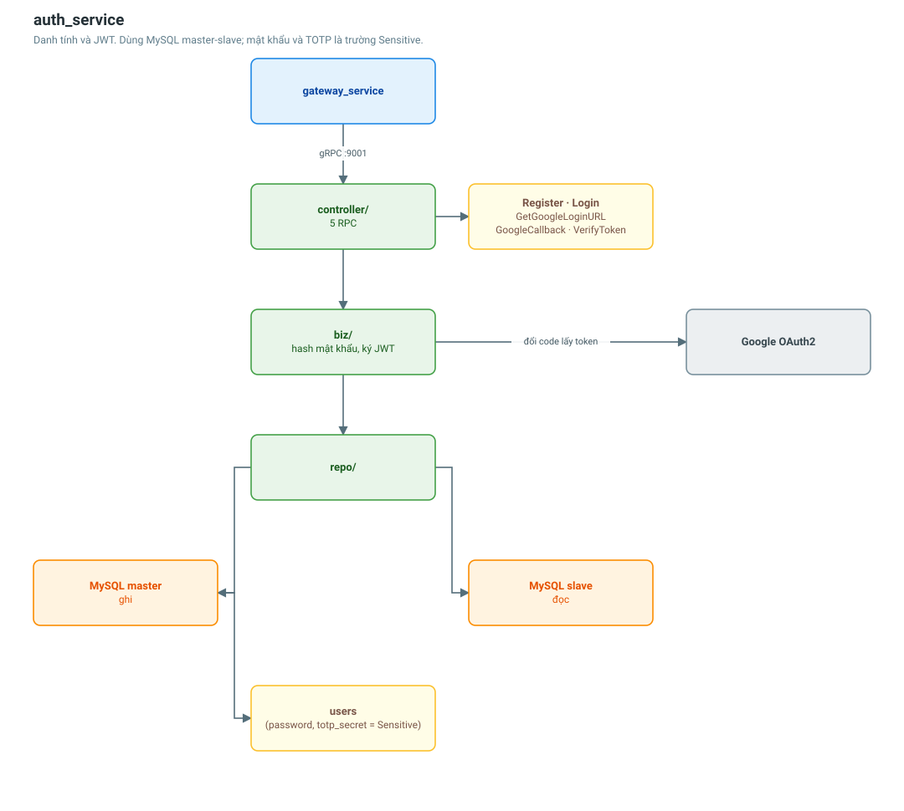

# auth_service

Danh tính và JWT: đăng ký, đăng nhập, Google OAuth2, xác minh token.

| | |
|---|---|
| Cổng | 9001 |
| Database | MySQL (master + slave) |
| Bảng | `users` |
| RPC | 5 |



## API

| RPC | Việc |
|---|---|
| `Register` | Tạo tài khoản bằng email + mật khẩu |
| `Login` | Kiểm tra mật khẩu, trả `TokenPair` |
| `GetGoogleLoginURL` | Sinh `state` và URL tới màn hình consent của Google |
| `GoogleCallback` | Đổi `code` lấy token, tạo/khớp tài khoản |
| `VerifyToken` | Giải mã JWT, trả `UserProfile` |

## Dữ liệu

Bảng `users` có ba trường **Sensitive** theo khai báo ent: `password`,
`totp_secret`, `google_id`. Ent đánh dấu Sensitive nghĩa là chúng không xuất hiện
khi in struct ra log — nhưng đó chỉ là lớp bảo vệ cuối. Nguyên tắc trong service
này: `entity.UserProfile` (model đọc) **không hề có** các trường đó, nên chúng
không thể lọt ra ngoài dây truyền kể cả trong lời gọi nội bộ.

## Quyết định thiết kế đáng chú ý

**Tách `UserRegister` và `UserLogin` thay vì một struct chung.**
Một struct làm nhiều việc dẫn tới validate rối (trường nào bắt buộc tuỳ luồng),
khó mock trong test, và mỗi lần luật nghiệp vụ của một luồng đổi là struct chung
lại phình thêm.

**Vì sao có `entity.User` riêng thay vì dùng thẳng `ent.Users`?**
`ent` là mối quan tâm hạ tầng — nó map thẳng vào cơ sở dữ liệu. Dùng `ent.Users`
trong biz/controller là để tầng nghiệp vụ phụ thuộc vào chi tiết lưu trữ. Tách ra
thì đổi ORM hay đổi loại database chỉ phải viết lại tầng repo.

## Cấu hình

```
AUTH_SERVICE_GRPC_PORT=9001
AUTH_SERVICE_JWT_SECRET=…
AUTH_SERVICE_DB_HOST=auth-db-master
AUTH_SERVICE_GOOGLE_CLIENT_ID=…
AUTH_SERVICE_GOOGLE_CLIENT_SECRET=…
AUTH_SERVICE_GOOGLE_REDIRECT_URL=…
```

## Liên quan

- [Đăng nhập Google và chống CSRF](../architecture/oauth-google-flow.md)
- [Luồng xác thực và phân quyền](../flows/authentication-flow.md)
