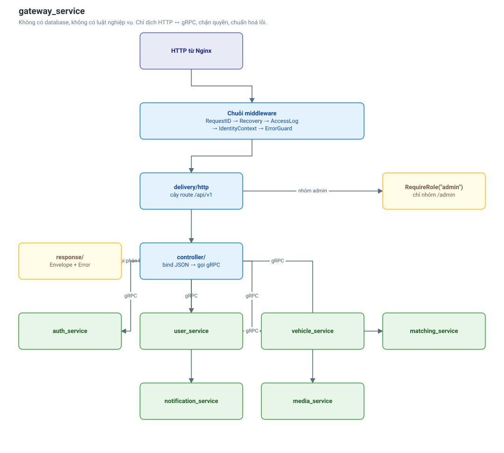

# gateway_service

Cửa duy nhất mà thế giới bên ngoài chạm được. Dịch HTTP ↔ gRPC, xác thực token,
chặn quyền, chuẩn hoá mọi phản hồi. **Không có database, không có luật nghiệp vụ.**

| | |
|---|---|
| Cổng | 8080 |
| Giao thức vào | HTTP (qua Nginx) |
| Giao thức ra | gRPC tới 6 service nội bộ |
| Database | không |
| Số endpoint | 67 (49 client + 18 admin) |



## Trách nhiệm

1. **Xác thực** — verify chữ ký RS256 tại chỗ bằng public key, không gọi mạng.
2. **Định tuyến** — ba nhánh: công khai, cần đăng nhập, và quản trị.
3. **Phân quyền** — `RequireRole(...)` gắn ở **cấp group**, không phải từng handler.
4. **Đổi dạng định danh** — 16 byte trên gRPC ↔ chuỗi UUID trên HTTP.
5. **Chuẩn hoá phản hồi** — cả lỗi lẫn thành công đều theo một khuôn cố định.
6. **Chống quá tải** — hạn chờ, giới hạn đồng thời, cân bằng tải giữa các bản sao.
7. **Truy vết** — mở span gốc, hợp nhất `X-Request-ID` với `trace_id`.

## Chuỗi middleware

Thứ tự đăng ký **có ý nghĩa**:

| Thứ tự | Middleware | Vì sao ở vị trí này |
|---|---|---|
| 1 | `otelgin` | Mở span gốc — phải trước mọi thứ để trace bao trọn request |
| 2 | `RequestID` | Lấy `trace_id` của span vừa mở làm mã truy vết |
| 3 | `Recovery` | Bọc ngoài phần còn lại để bắt được cả panic của chúng |
| 4 | `AccessLog` | Ghi method, path, status, thời gian, `trace_id`, người gọi |
| 5 | `StripClientIdentity` | Xoá header danh tính client tự khai, **trước** khi xác thực |
| 6 | `ErrorGuard` | Lưới an toàn: render lỗi mà handler quên render |

Rồi theo từng nhóm route: `auth.Required()` và `RequireRole(...)`.

Dùng `gin.New()` chứ **không** `gin.Default()`: Logger và Recovery mặc định của
gin ghi log dạng text và trả body 500 không theo khung lỗi chung của hệ thống.

## Ba nhánh route

```go
publicAuth := api.Group("/auth")                       // đăng ký, đăng nhập, refresh
secured    := api.Group("", auth.Required())           // mọi endpoint người dùng
admin      := api.Group("/admin", auth.Required(),
                        middleware.RequireRole(authn.RoleAdmin))
```

Gắn bảo vệ ở **cấp group** nghĩa là không thể "quên" bảo vệ một endpoint mới.
`TestNoUnintentionallyPublicRoute` duyệt mọi route và bắt buộc route nào không nằm
trong danh sách công khai đều phải trả 401 khi không có token.

Chi tiết mô hình xác thực: [Luồng xác thực và phân quyền](../flows/authentication-flow.md).

## Khung phản hồi

Thành công:

```json
{ "data": { }, "message": "…", "request_id": "018f…" }
```

Lỗi:

```json
{ "error": { "code": "USER_NOT_FOUND", "message": "…", "details": { } },
  "request_id": "018f…" }
```

Client nên switch theo `error.code` — mã này ổn định theo thời gian, còn
`message` là câu chữ có thể đổi. `request_id` chính là `trace_id` trên Jaeger.

## Định danh: bytes bên trong, chuỗi bên ngoài

Trên dây gRPC, mọi id là `bytes` — đúng 16 byte thô của một UUID v7. Ra tới HTTP,
gateway đổi sang chuỗi canonical 36 ký tự.

**Vì sao bytes bên trong.** Chuỗi UUID tốn 36 byte + header, dạng bytes tốn 16 +
header — tiết kiệm 20 byte cho **mỗi** field id. Message `Ask`/`Bid` có 5 id một
cái, và app tài xế báo GPS vài giây một lần cho từng xe. Parse 16 byte cũng chỉ là
một phép copy, trong khi parse chuỗi 36 ký tự phải scan và decode hex.

**Vì sao chuỗi bên ngoài.** Bytes không tự mô tả: `encoding/json` in chúng ra
base64 (`"PyZ8EJpOeyGPM1wNLmpxtA=="`) — không dán được vào URL, không tra được
trong log, không đọc được bằng mắt.

**Vì sao ranh giới nằm đúng ở gateway.** Bên trong mạng nội bộ ưu tiên tốc độ, bên
ngoài ưu tiên con người đọc được. Gateway vốn đã là chỗ dịch giữa hai thế giới.

Toàn bộ phép đổi dạng đi qua `pkg/uuidx`, và ở gateway thì gom vào hai file:

| File | Vai trò |
|---|---|
| `internal/controller/ids.go` | HTTP → gRPC: parse id từ path/query/body |
| `internal/controller/dto.go` | gRPC → HTTP: dựng DTO trả về client |

> **Vì sao gom về một chỗ.** Ép kiểu trực tiếp giữa `string` và `[]byte` trong Go
> luôn hợp lệ về mặt biên dịch: `[]byte("3f2b7c10-…")` cho ra 36 byte thay vì 16,
> và proto nhận `bytes` thì độ dài nào cũng vừa. Sai lệch kiểu này không dừng ở
> đâu cả cho tới khi thành dữ liệu hỏng trong DB. `uuidx.FromBytes` từ chối mọi
> slice không dài đúng 16 byte, biến nó thành lỗi 400 tại biên.

### Vì sao không tách một service riêng để convert

Đổi 16 byte ↔ chuỗi 36 ký tự tốn khoảng **60ns** (đo bằng `BenchmarkParse` trong
`pkg/uuidx`). Một network hop tốn 0.5–1ms — chậm hơn khoảng **mười nghìn lần**, và
thêm một điểm chết mới.

Sam Newman (*Building Microservices*) gọi việc tách service theo **technical
layer** thay vì **business capability** là đường dẫn thẳng tới distributed
monolith. Shared package đạt được cùng mục tiêu tách bạch trách nhiệm mà không
phải trả giá mạng.

## Lớp DTO

Gateway **không** trả thẳng proto message ra JSON. Serialize proto bằng
`encoding/json` (thứ `ctx.JSON` dùng) cho kết quả sai ở ba chỗ:

| Vấn đề | Biểu hiện |
|---|---|
| Timestamp | `{"created_at":{"seconds":1735689600}}` thay vì `"2025-01-01T00:00:00Z"` |
| Field rỗng | `status:""`, `total_trips:0` biến mất vì tag `omitempty` |
| ID | In ra base64 thay vì chuỗi UUID |

Lợi ích kèm theo: hợp đồng **đối ngoại** tách khỏi hợp đồng **nội bộ**. Thêm field
vào proto không còn tự động phơi nó ra Internet; đổi tên field nội bộ không làm vỡ
app đang chạy.

## Chống quá tải

Bốn cơ chế, xếp theo mức độ đáng tiền:

**1. Hạn chờ mỗi lần gọi** (`GATEWAY_GRPC_TIMEOUT`, mặc định 5s). Quan trọng nhất.
Không có hạn chờ, một service nội bộ treo sẽ khiến gateway giữ goroutine và kết
nối vô thời hạn, tới lúc cạn tài nguyên thì sập — kéo theo cả hệ thống vì gateway
là cửa duy nhất.

Các RPC vị trí dùng hạn ngắn hơn (`GATEWAY_GRPC_LOCATION_TIMEOUT`, 2s): bản tin
GPS tới muộn 5 giây thì đã vô nghĩa vì xe đã ở chỗ khác.

**2. Giới hạn đồng thời** (`GATEWAY_MAX_CONCURRENT_PER_UPSTREAM`, mặc định 256).
Timeout giới hạn *thời gian* một request chiếm tài nguyên, nhưng không giới hạn
*số* request cùng chiếm. Một upstream chậm từ 20ms lên 3s sẽ khiến số request đồng
thời tăng gấp trăm lần dù mỗi cái vẫn kết thúc đúng hạn.

Đầy thì **từ chối ngay**, không xếp hàng: hàng đợi chỉ đổi lỗi nhanh thành lỗi
chậm, mà client đã bỏ cuộc từ lâu thì công server làm ra thành vô ích. Trả
`RESOURCE_EXHAUSTED` để client biết mà thử lại sau.

**3. Cân bằng tải round-robin.**

```go
grpc.WithDefaultServiceConfig(`{"loadBalancingConfig":[{"round_robin":{}}]}`)
```

grpc-go mặc định dùng `pick_first`: dù DNS trả về ba địa chỉ cho `user-service`,
client vẫn bám vào **một** địa chỉ đầu tiên. Nhân bản lên ba mà không đổi dòng này
thì hai bản sao kia không nhận được request nào — triệu chứng rất dễ hiểu nhầm là
"đã scale rồi mà vẫn chậm".

Địa chỉ cũng phải có tiền tố `dns:///`. Không có nó, gRPC phân giải đúng **một
lần** lúc khởi động; bản sao được thay thế thì IP đổi, và client sẽ đâm mãi vào
địa chỉ đã chết cho tới khi ai đó khởi động lại gateway.

**4. Timeout ở tầng HTTP server** (`Read`/`Write`/`IdleTimeout`). Không có chúng,
một client mở kết nối rồi gửi request nhỏ giọt sẽ giữ một goroutine vô thời hạn —
kiểu tấn công Slowloris, và cũng là điều xảy ra tự nhiên với app di động mất sóng.

Nginx bổ sung rate limit theo IP ở biên. Lưu ý giới hạn của nó: một hợp tác xã sau
NAT dùng chung một IP, nên rate limit theo IP có thể chặn nhầm cả đoàn xe. Giới
hạn theo **người dùng** vẫn là việc còn phải làm.

## Quyết định thiết kế đáng chú ý

**Vì sao controller không có một dòng `status.Errorf` nào?**
Service nội bộ đã gắn `ErrorInfo` vào gRPC status (xem `pkg/middleware`).
`response.Error(ctx, err)` bóc ra và tự chọn HTTP status. Để mỗi controller tự map
lỗi thì mã trạng thái phụ thuộc vào việc người viết handler có nhớ phân biệt
"không tìm thấy" với "lỗi máy chủ" hay không.

**Vì sao gateway không giữ private key?**
Có public key thì verify được nhưng không ký được. Gateway là thứ phơi ra Internet;
nó không được phép giữ thứ gì phát hành ra danh tính mới.

**Vì sao `grpc.NewClient` là lazy?**
Nó không bắt tay ngay mà kết nối ở lần gọi đầu. Nhờ vậy gateway khởi động được kể
cả khi service phía sau chưa sẵn sàng — chuyện bình thường khi cả cụm cùng bật lên
trong docker-compose.

## Cấu hình

```
GATEWAY_PORT=8080

# Xác thực — CHỈ public key
GATEWAY_JWT_PUBLIC_KEY=/run/secrets/jwt_public.pem
GATEWAY_JWT_PREVIOUS_PUBLIC_KEY=            # chỉ đặt khi đang xoay khoá

# Địa chỉ service nội bộ
GATEWAY_AUTH_GRPC_ADDR=auth-service:9001
GATEWAY_MEDIA_GRPC_ADDR=media-service:9002
GATEWAY_MATCHING_GRPC_ADDR=matching-service:9003
GATEWAY_USER_GRPC_ADDR=user-service:9004
GATEWAY_VEHICLE_GRPC_ADDR=vehicle-service:9005
GATEWAY_NOTIFICATION_GRPC_ADDR=notification-service:9006

# Chống quá tải
GATEWAY_GRPC_TIMEOUT=5s
GATEWAY_GRPC_LOCATION_TIMEOUT=2s
GATEWAY_MAX_CONCURRENT_PER_UPSTREAM=256

# Khác
GATEWAY_CORS_ORIGINS=http://localhost:3000,http://localhost:8080
OTEL_EXPORTER_OTLP_ENDPOINT=jaeger:4317
```

Toàn bộ nằm ở `internal/conf/conf.go` và được kiểm **lúc khởi động**, nên biến
thiếu hoặc gõ sai tên làm service dừng ngay khi deploy thay vì lộ ra giữa lúc
phục vụ.

## Liên quan

- [Luồng xác thực và phân quyền](../flows/authentication-flow.md)
- [Luồng lỗi xuyên tầng](../flows/error-handling-flow.md)
- [Quan sát hệ thống (OpenTelemetry)](../architecture/observability.md)
