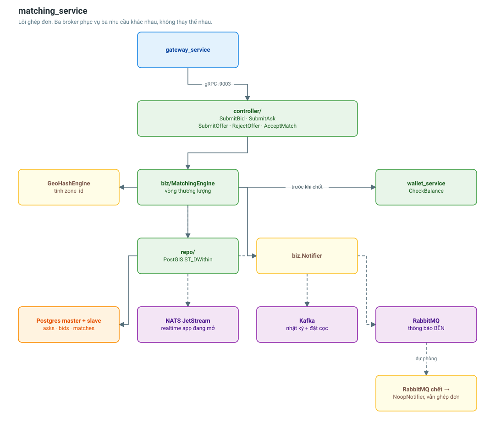

# matching_service

Lõi ghép đơn hàng với xe còn chỗ trống, và vòng thương lượng giá giữa hai bên.

| | |
|---|---|
| Cổng | 9003 |
| Database | Postgres (master + slave, có PostGIS) |
| Broker | RabbitMQ · Kafka · NATS JetStream |
| Bảng | 5 |
| RPC | 5 |



## API

| RPC | Ai gọi | Việc |
|---|---|---|
| `SubmitBid` | Chủ hàng | Đăng đơn cần xe |
| `SubmitAsk` | Tài xế | Đăng chuyến còn chỗ trống |
| `SubmitOffer` | Tài xế | Báo giá cho một đơn cụ thể |
| `RejectOffer` | Chủ hàng | Từ chối báo giá, đơn quay lại `PENDING` |
| `AcceptMatch` | Chủ hàng | Chốt xe, sinh hợp đồng |

## Vòng thương lượng

```
bid (PENDING) ──offer──► NEGOTIATING ──accept──► MATCHED
                              │
                              └──reject──► PENDING (tài xế khác tiếp tục ra giá)
```

Trạng thái `NEGOTIATING` đóng vai trò khoá mềm: khi một tài xế đã ra giá, các tài
xế khác nhận `matching.drivers.rejected` ngay lập tức thay vì chờ vô vọng.

## Ba broker, ba nhu cầu

Đây là điểm dễ gây khó hiểu nhất của service này. Chúng KHÔNG thay thế nhau:

| Broker | Vai trò | Vì sao không dùng cái khác |
|---|---|---|
| **Kafka** | Nhật ký sự kiện lâu dài, đặt cọc ví | Không có retry/DLQ theo từng message |
| **NATS core** | Đẩy realtime tới app đang mở | Không giữ message cho người offline |
| **RabbitMQ** | Thông báo bền tới người dùng | Fan-out theo routing key, retry, dead-letter |

Tài xế đang lái xe, app ở chế độ nền hoặc mất sóng thì message NATS bay mất.
RabbitMQ giữ message tới khi notification_service ghi được vào hộp thư.

## Quyết định thiết kế đáng chú ý

**`biz.Notifier` là interface, không phải client RabbitMQ.**
Tầng biz không hề biết bên dưới là RabbitMQ. Khi test chỉ cần một cài đặt ghi vào
slice là đủ.

**RabbitMQ chết không được làm hỏng việc ghép đơn.**
DI rơi về `NoopNotifier`, đơn vẫn vào DB và vẫn ghép được qua các luồng khác. Mất
thông báo là chuyện nhỏ hơn nhiều so với mất đơn hàng. Có test khoá lại bất biến này.

**Kiểm tra số dư trước khi chốt, đóng băng tiền cọc sau.**
`CheckBalance` gọi đồng bộ sang wallet_service; việc `HoldDeposit` thực tế đi qua
Kafka topic `wallet.hold_deposit`. Kiểm tra trước để tránh phát một khoản đặt cọc
chắc chắn sẽ bị từ chối vì thiếu tiền.

**ID trong proto vẫn là `bytes`.**
Khác với user/vehicle/notification đã chuyển sang `string`. Gateway phải parse
tường minh qua `uuidBytes()`. Giữ nguyên vì đổi sẽ phá vỡ hợp đồng với các
consumer Kafka/NATS đang chạy.

## Sự kiện phát ra (RabbitMQ)

| Routing key | Khi nào | Người nhận |
|---|---|---|
| `matching.driver.candidates_found` | Chủ hàng đăng đơn, tìm được tài xế phù hợp | Từng tài xế |
| `matching.match.found` | Đã chốt xe | Cả chủ hàng và tài xế |
| `matching.offer.received` | Tài xế vừa báo giá | Chủ hàng |
| `matching.offer.rejected` | Chủ hàng từ chối giá | Tài xế |
| `matching.cargo.suggested` | Tài xế đăng chuyến rỗng, tìm được đơn | Tài xế đó |

## Cấu hình

```
MATCHING_SERVICE_GRPC_PORT=9003
MATCHING_DB_MASTER_HOST=matching-db-master
MATCHING_DB_SLAVE_HOST=matching-db-slave
KAFKA_BROKERS=broker-1:19092,broker-2:19092,broker-3:19092
RABBITMQ_HOST=rabbitmq
MATCHING_MQ_ENABLED=true
MATCHING_WALLET_GRPC_ADDR=wallet-service:9007
```

## Liên quan

- [Luồng ghép xe và thông báo](../flows/matching-notification-flow.md)
- [Luồng chủ hàng đặt đơn](../flows/shipper-order-flow.md)
- [vehicle_service](vehicle-service.md) — nguồn dữ liệu xe đang chạy
