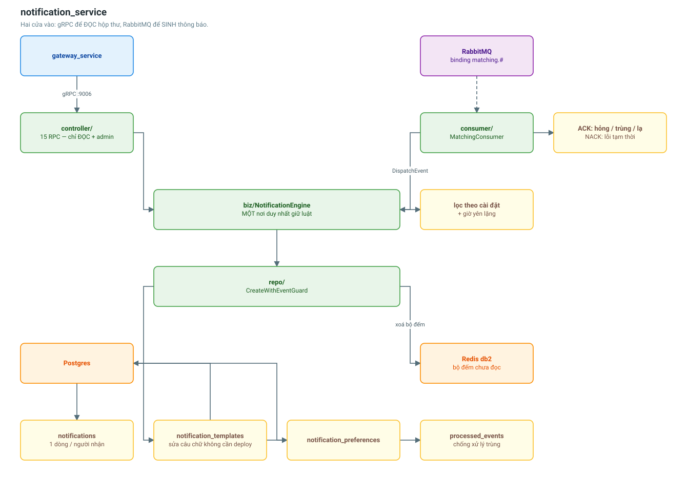

# notification_service

Hộp thư thông báo của người dùng. Đây là đầu ra của luồng sự kiện.

| | |
|---|---|
| Cổng | 9006 |
| Database | Postgres (một node) |
| Cache | Redis db 2, prefix `notif` |
| Broker | RabbitMQ (consumer) |
| Bảng | 4 |
| RPC | 15 (8 client + 7 admin) |



## Hai cửa vào

Đây là điểm khác biệt so với các service khác:

| Cửa | Việc |
|---|---|
| **gRPC** | Người dùng ĐỌC hộp thư, admin quản lý template |
| **RabbitMQ** | matching_service phát sự kiện, ta SINH thông báo |

Không có API public nào để "tạo thông báo". Cả hai cửa đều đi qua cùng một
`NotificationEngine`, nên quy tắc "tôn trọng cài đặt nhận tin của người dùng" chỉ
tồn tại đúng một chỗ.

## Dữ liệu

| Bảng | Vai trò |
|---|---|
| `notifications` | Một dòng cho MỘT người nhận |
| `notification_templates` | Câu chữ sửa được không cần deploy |
| `notification_preferences` | Người dùng chọn nhận gì, qua kênh nào |
| `processed_events` | Sổ chống xử lý trùng cho consumer |

**Vì sao một sự kiện đẻ ra nhiều dòng?**
"Đã tìm được xe" sinh HAI bản ghi: một cho chủ hàng, một cho tài xế. Gộp chung
một dòng nhiều người nhận thì cờ `is_read` vô nghĩa, vì hai người đọc ở hai thời
điểm khác nhau.

## Chống xử lý trùng

RabbitMQ bảo đảm *ít nhất một lần*, không phải *đúng một lần*. Service chết sau
khi ghi DB nhưng trước khi ACK sẽ khiến message được giao lại, và tài xế nhận hai
lần cùng một thông báo.

`CreateWithEventGuard` ghi `event_id` vào `processed_events` TRONG CÙNG transaction
với việc tạo thông báo:

```
commit thành công -> thông báo đã tạo VÀ dấu đã ghi, không thể lệch nhau
event_id trùng    -> transaction rollback, không sinh thông báo trùng
```

Tách hai bước ra ngoài transaction thì chỉ cần service chết đúng khe giữa chúng
là hỏng.

## Hành vi ACK / NACK của consumer

| Tình huống | Hành động | Vì sao |
|---|---|---|
| Xử lý xong | ACK | — |
| JSON hỏng | **ACK** | Retry bao nhiêu lần cũng hỏng, giữ lại chỉ làm nghẽn queue |
| `event_id` trùng | **ACK** | Đã xử lý rồi, không phải lỗi |
| Routing key lạ | **ACK** | Binding `matching.#` bắt cả sự kiện chưa quan tâm |
| DB rớt | **NACK** | Lỗi tạm thời, đáng thử lại |

NACK lần đầu thì requeue; đã redelivered mà vẫn hỏng thì đẩy sang
`notification.events.dlq` để người trực xem — tránh vòng lặp "lỗi → requeue → lỗi".

## Luật lọc trước khi ghi

Lọc theo `NotificationPreference` TRƯỚC KHI GHI, không phải trước khi gửi: người
đã tắt nhận thông báo ghép đơn thì không nên thấy chúng nằm sẵn trong hộp thư.

**Giờ yên lặng chỉ chặn PUSH**, không chặn hẳn. Thông báo vẫn vào hộp thư để sáng
hôm sau người dùng mở app là thấy. Khung qua đêm (22:00 đến 07:00) dùng điều kiện
HOẶC chứ không phải VÀ — có test riêng cho điểm này vì rất dễ viết sai.

**Không đọc được cài đặt thì vẫn gửi.** Bỏ sót một thông báo ghép đơn tốn kém hơn
nhiều so với gửi thừa một thông báo.

## Template

Dùng thay chuỗi thuần `{{key}}`, cố tình KHÔNG dùng `text/template`: template do
admin nhập qua API, mà `text/template` cho phép gọi hàm và truy cập field — mở
đường cho một template sai (hoặc cố ý) làm panic tiến trình gửi thông báo. Thay
chuỗi thì trường hợp xấu nhất chỉ là câu chữ còn nguyên `{{placeholder}}`.

## Cấu hình

```
NOTIFICATION_SERVICE_PORT=9006
NOTIFICATION_DB_HOST=notification-db
NOTIFICATION_REDIS_DB=2
RABBITMQ_EXCHANGE=logistic.events
NOTIFICATION_MQ_QUEUE=notification.events
NOTIFICATION_MQ_BINDINGS=matching.#
NOTIFICATION_MQ_PREFETCH=20
```

Consumer dựng không được thì service VẪN khởi động (API đọc hộp thư còn phục vụ
được), nhưng không có thông báo mới nào được sinh ra — DI log ở mức NGHIÊM TRỌNG.

## Chưa làm

- **Push/email/SMS thật** chưa nối nhà cung cấp (FCM/SendGrid). Thông báo được ghi
  vào hộp thư và đánh dấu kênh đúng; phần bắn ra ngoài là bước tiếp theo.
- **Broadcast theo vai trò** (`AdminSendNotification` với `broadcast_role`) cần
  user_service trả danh sách user theo role — chưa nối. Hiện API từ chối rõ ràng
  thay vì âm thầm không gửi gì.

## Liên quan

- [Luồng ghép xe và thông báo](../flows/matching-notification-flow.md)
- [matching_service](matching-service.md) — bên phát sự kiện
