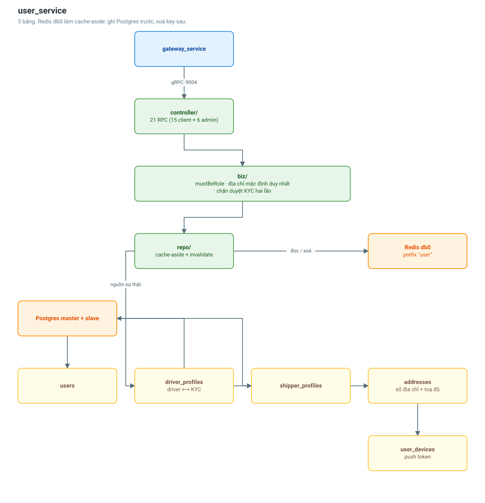

# user_service

Danh tính nghiệp vụ, hồ sơ tài xế/chủ hàng, sổ địa chỉ và thiết bị nhận push.

| | |
|---|---|
| Cổng | 9004 |
| Database | Postgres (master + slave) |
| Cache | Redis db 0, prefix `user` |
| Bảng | 5 |
| RPC | 21 (15 client + 6 admin) |



## Dữ liệu

| Bảng | Vai trò |
|---|---|
| `users` | Danh tính gốc: phone, email, role, status |
| `driver_profiles` | Bằng lái, CCCD, điểm đánh giá, trạng thái KYC |
| `shipper_profiles` | Tên công ty, mã số thuế, địa chỉ kinh doanh |
| `addresses` | Sổ địa chỉ **kèm toạ độ** |
| `user_devices` | Push token theo từng thiết bị |

**Vì sao `addresses` lưu sẵn latitude/longitude?**
Khi chủ hàng tạo đơn, matching cần toạ độ ngay để tính zone. Nếu chỉ lưu chữ thì
mỗi lần đặt đơn lại phải gọi geocoding bên thứ ba — chậm và tốn tiền cho dữ liệu
gần như không bao giờ đổi.

**Vì sao `license_number` và `id_card` là Optional + Nillable?**
Hai cột này UNIQUE. Lúc đăng ký, tài xế chưa có bằng lái nên giá trị phải là NULL.
Nếu để chuỗi rỗng thì unique index nổ ngay ở **tài xế thứ hai** — Postgres coi
nhiều NULL là khác nhau, nhưng nhiều chuỗi rỗng là trùng. Đây là lỗi đã từng có
trong repo, nay được khoá lại bằng test tích hợp.

## Chiến lược cache

```
ĐỌC : Redis → miss → Postgres → ghi ngược lên Redis kèm TTL
GHI : Postgres trước, XOÁ key liên quan sau (không ghi đè)
```

**Xoá chứ không ghi đè.** Ghi đè mở ra khả năng hai request đồng thời ghi lộn thứ
tự và để lại bản cũ trong cache. Xoá thì tệ nhất chỉ là một lần cache miss.

TTL vẫn được đặt dù đã invalidate chủ động: nếu một luồng ghi nào đó quên xoá key,
dữ liệu bẩn cũng tự hết hạn thay vì nằm lại mãi.

Cache có **hai** key cho cùng một user: theo `id` và theo `phone`. Cả hai đều phải
được xoá khi ghi — quên một cái là luồng đăng nhập bằng số điện thoại vẫn thấy dữ
liệu cũ. Có test tích hợp riêng cho điểm này.

`ListAddresses` chỉ cache **trang đầu không lọc** — đó là thứ app gọi ở màn hình
tạo đơn, chiếm gần như toàn bộ lưu lượng. `ListUsers` (admin) **không** cache: số
tổ hợp filter + trang là vô hạn nên tỉ lệ trúng gần bằng không.

## Luật nghiệp vụ đáng chú ý

- `mustBeRole` — chặn gọi API hồ sơ tài xế trên tài khoản chủ hàng. Không có bước
  này, repo sẽ trả "không tìm thấy hồ sơ", một câu vừa sai nguyên nhân vừa khiến
  client đi dò mò.
- **Một địa chỉ mặc định duy nhất** — đặt cờ mới thì hạ cờ cũ trước, trong cùng
  luồng.
- **Chặn duyệt KYC hai lần** — hồ sơ đã `approved`/`rejected` thì không cho duyệt
  lại. Một cú bấm nhầm sẽ lật ngược quyết định cũ mà không để lại dấu vết ai đã đổi.
- `UpsertDevice` **chuyển chủ** bản ghi khi cùng một `device_token` được đăng ký
  bởi tài khoản khác — nếu không, push của tài khoản cũ vẫn bắn vào máy người dùng mới.

## Cấu hình

```
USER_SERVICE_PORT=9004
USER_DB_HOST=user-db-master
USER_REDIS_DB=0
USER_REDIS_PREFIX=user
USER_REDIS_ENABLED=true
```

Redis hỏng **không** làm service chết: `redisClient` là nil và mọi truy vấn xuống
thẳng Postgres.

## Liên quan

- [Luồng tài xế gia nhập hệ thống](../flows/driver-onboarding-flow.md)
- [vehicle_service](vehicle-service.md)
