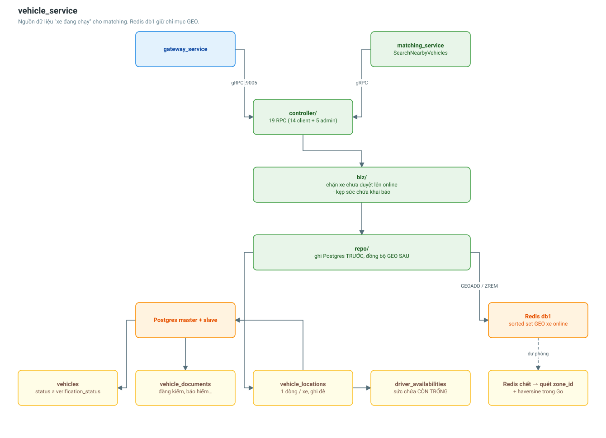

# vehicle_service

Phương tiện, giấy tờ, vị trí GPS và trạng thái sẵn sàng nhận đơn. Đây là **nguồn
dữ liệu "xe đang chạy"** cho matching_service.

| | |
|---|---|
| Cổng | 9005 |
| Database | Postgres (master + slave) |
| Cache | Redis db 1, prefix `vehicle` — **kiêm chỉ mục GEO** |
| Bảng | 4 |
| RPC | 19 (14 client + 5 admin) |



## Dữ liệu

| Bảng | Vai trò |
|---|---|
| `vehicles` | Xe của tài xế; `status` và `verification_status` tách riêng |
| `vehicle_documents` | Đăng kiểm, bảo hiểm, đăng ký, bằng lái — admin duyệt từng cái |
| `vehicle_locations` | Vị trí GPS **mới nhất**, mỗi xe đúng một dòng |
| `driver_availabilities` | Công tắc nhận đơn + sức chứa **còn trống** |

**Vì sao tách `status` khỏi `verification_status`?**
`status` do tài xế tự đổi (đang chạy / bảo dưỡng). `verification_status` chỉ admin
đổi được sau khi soi giấy tờ. Gộp làm một thì tài xế có thể tự tuyên bố xe mình
hợp lệ.

**Vì sao `vehicle_locations` ghi đè thay vì lưu lịch sử?**
Tài xế ping GPS vài giây một lần; nhân với hàng nghìn xe là hàng triệu dòng mỗi
ngày. Bảng này chỉ cần trả lời "xe đang ở đâu".

**`available_*` khác `capacity_*`:** capacity là sức chứa tối đa của xe, available
là phần còn trống sau khi đã nhận các đơn trước đó.

## Chỉ mục GEO — phần đáng nói nhất

Bài toán: mỗi đơn hàng cần tìm xe quanh điểm lấy hàng, trong khi bảng vị trí đang
bị ghi liên tục. Để Postgres gánh nghĩa là quét chỉ mục không gian trên một bảng
nóng — đúng công thức tạo nút thắt cổ chai.

Redis GEO là sorted set với score là geohash 52-bit, nên `GEOSEARCH` trả về trong
vài mili-giây ngay trên RAM.

`SearchNearby` chạy ba bước:

1. `GEOSEARCH` → danh sách `vehicle_id` kèm khoảng cách, đã sắp gần → xa (lấy dư ×3).
2. **Hai** truy vấn gộp xuống Postgres lấy thông tin xe + sức chứa trống — tránh N+1.
3. Lọc: đã duyệt giấy tờ · đang `active` · đúng loại xe · đủ tải/đủ khối.

Lọc ở bước 3 chứ không bước 1 vì Redis GEO chỉ biết toạ độ, không biết xe còn
trống bao nhiêu. Lấy dư ở bước 1 để sau khi loại bớt vẫn đủ số lượng yêu cầu.

### Đồng bộ chỉ mục

Xe phải **rời chỉ mục ngay** khi:

- tài xế tắt nhận đơn,
- xe chuyển sang `maintenance` / `inactive`,
- admin từ chối duyệt xe,
- xe bị xoá.

Thiếu bất kỳ điểm nào ở trên là matching sẽ gán đơn cho một chiếc xe nằm garage.
Cả bốn đều có test tích hợp.

### Khi Redis chết

Rơi về đường dự phòng: lọc thô theo ô lưới `zone_id` (ô hiện tại + 8 ô xung quanh)
rồi tính haversine trong Go. Chậm hơn, nhưng hệ thống **vẫn ghép được đơn** — và
đó mới là điều quan trọng.

### Thứ tự ghi

Postgres **trước**, Redis **sau**. Nếu ghi Redis trước mà Postgres hỏng, chỉ mục
sẽ chứa một xe mà bảng vị trí không hề biết tới. Ngược lại thì tệ nhất là chỉ mục
chậm hơn DB đúng một nhịp ping — hoàn toàn chấp nhận được.

## Cấu hình

```
VEHICLE_SERVICE_PORT=9005
VEHICLE_DB_HOST=vehicle-db-master
VEHICLE_REDIS_DB=1
VEHICLE_REDIS_PREFIX=vehicle
VEHICLE_REDIS_ENABLED=true
```

## Liên quan

- [Luồng GPS và tìm xe đang chạy](../flows/driver-location-flow.md)
- [Luồng tài xế gia nhập hệ thống](../flows/driver-onboarding-flow.md)
- [matching_service](matching-service.md)
