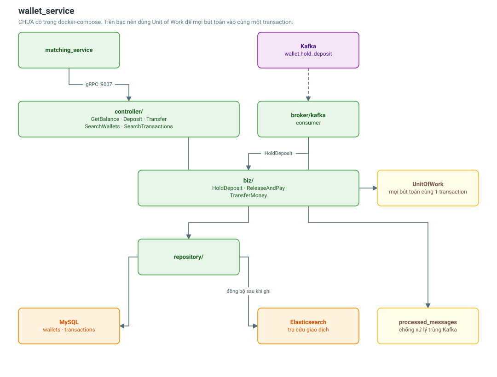

# wallet_service

Ví tiền, giao dịch và đặt cọc.

**Lưu ý: service này CHƯA có trong `docker-compose.yml`.** matching_service gọi
sang đây để `CheckBalance` trước khi chốt match; chưa dựng thì lời gọi sẽ lỗi và
matching ghi log rồi đi tiếp.

| | |
|---|---|
| Cổng | 9007 |
| Database | MySQL |
| Tra cứu | Elasticsearch |
| Broker | Kafka (consumer) |
| Bảng | 3 |
| RPC | 5 |



## API

| RPC | Việc |
|---|---|
| `GetBalance` | Số dư hiện tại |
| `Deposit` | Nạp tiền |
| `Transfer` | Chuyển tiền giữa hai ví |
| `SearchWallets` | Tra cứu ví (Elasticsearch) |
| `SearchTransactions` | Tra cứu giao dịch (Elasticsearch) |

Ngoài ra `HoldDeposit` và `ReleaseAndPay` KHÔNG phơi ra gRPC — chúng chỉ được gọi
từ consumer Kafka khi matching_service phát `wallet.hold_deposit`.

## Quyết định thiết kế đáng chú ý

**Unit of Work.** Mọi bút toán của một nghiệp vụ phải nằm trong cùng một
transaction. Với tiền bạc, trừ ví A thành công mà cộng ví B thất bại là hỏng
không cứu được. `UnitOfWorkRepository.Do(ctx, fn)` bọc toàn bộ `fn` trong một
transaction và truyền `ctxTx` xuống các repo con.

**Bảng `processed_messages`.** Kafka cũng là *ít nhất một lần*. Không có sổ chống
trùng thì một message đặt cọc được giao lại sẽ trừ tiền hai lần.

**Elasticsearch là bản sao đọc, không phải nguồn sự thật.** Ghi MySQL trước rồi
mới đồng bộ sang ES. ES chết thì tra cứu hỏng nhưng số dư vẫn đúng.

## Cần làm trước khi đưa vào compose

1. Thêm service + MySQL vào `docker-compose.yml`.
2. Thêm vào `ALL_DIRS` / `ALL_SVCS` và bộ lọc đường dẫn trong
   `.github/workflows/application.yml`.
3. Sửa lỗi `buf lint`: các message đang tên `GetBalanceReq` / `GetBalanceRes`,
   chuẩn là `GetBalanceRequest` / `GetBalanceResponse`.

## Cấu hình

```
WALLET_SERVICE_GRPC_PORT=9007
WALLET_SERVICE_DB_DSN=…
WALLET_SERVICE_KAFKA_BROKERS=broker-1:19092,broker-2:19092,broker-3:19092
WALLET_SERVICE_ES_ADDRESSES=http://elasticsearch:9200
```

## Liên quan

- [matching_service](matching-service.md) — bên gọi `CheckBalance`
- [Luồng chủ hàng đặt đơn](../flows/shipper-order-flow.md)
- [Ghi chú Elasticsearch](../reference/elasticsearch.md)
